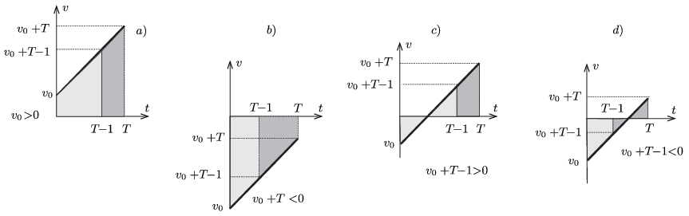
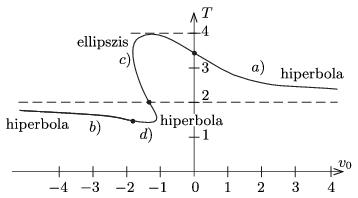

**Megoldás.**
 A leírt mozgás többféleképpen is megvalósulhat:
 $a)$ A kiskocsit a lejtőn lefelé lökjük meg.
 $b)$ A kiskocsit a lejtőn felfelé lökjük meg, és az végig felfelé mozog.
 $c)$ A felfelé meglökött kiskocsi megáll, majd még legalább 1 másodpercig mozog.
 $d)$ A felfelé indított kiskocsi sebessége a mozgás utolsó másodpercében csökken nullára és vált előjelet.
 Ha valamekkora nagyságú gyorsulás mellett teljesül az időtartamokra vonatkozó feltétel, akkor a pillanatnyi sebességeket egy $k$ számmal megszorozva továbbra is igaz marad az időarányokra vonatkozó feltétel; ebben az esetben azonban a gyorsulás nagysága a korábbi érték $k$-szorosa lesz. Mivel $k$ tetszőleges, a végeredmény nem függhet az $a$ gyorsulás nagyságától, az tehát akár $1~\rm m/s^2$-nek is választható. (A továbbiakban SI mértékegységeket használunk, és azokat nem írjuk ki.)
 Válasszuk a lejtőn lefelé mutató irányt pozitívnak, és ábrázoljuk a sebességet az idő függvényében! Jelöljük a mozgás teljes idejét $T$-vel, a test kezdősebességét pedig $v_0$-lal. A gyorsulás mindvégig $a=+1$.
 A felsorolt 4 esetben a sebesség-idő függvény az 1. ábrán látható grafikonokkal szemléltethető:

 1. ábra
 Az időtartamokra és utakra vonatkozó feltétel akkor teljesül, ha egy-egy ábrán a világosan és a sötéten jelölt terület nagysága megegyezik. Ez a feltétel kapcsolatot teremt $T$ és $v_0$ között, amiből leolvasható $T$ lehetséges legnagyobb éretéke.
 $a)$ Ha a kiskocsit a lejtőn lefelé lökjük meg:
 $\left(v_0+\frac{T-1}{2}\right)(T-1)=v_0+T-\frac{1}{2},$
 ahonnan a kezdősebesség kifejezhető $T$ segítségével:
 $v_0=\frac{2-(T-2)^2}{2(T-2)}.$
 Mivel $v_0\ge0$ és $T>1$, fenn kell álljon, hogy
 $2<T\le 2+\sqrt2\approx 3{,}4.$
 A leghosszabb mozgás $v_0=0$-nak felel meg, ekkor $T_\text{max}^{(a)}=3{,}4~\rm s.$
 $b)$ Ha a kiskocsit a lejtőn felfelé lökjük meg, és az végig felfelé mozog:
 A képletek ugyanazok, mint az előző esetben:
 $v_0=\frac{2-(T-2)^2}{2(T-2)},$
 de most $v_0+T\le0$, ami akkor teljesül, ha
 $\sqrt2\le T<2.$
 A mozgás idejének felső határát ($T_\text{max}^{(b)}=2{,}0~\rm s$-ot) akkor közelíthetjük meg, ha a kezdősebesség abszolút értéke nagyon nagy .
 $c)$ A felfelé meglökött kiskocsi a mozgás utolsó másodpercében végig lefelé mozog:
 $\frac{v_0^2}{2}+ \frac{(v_0+T-1)^2}{2}=\frac{(v_0+T)^2}{2}-\frac{(v_0+T-1)^2}{2},$
 ahonnan algebrai átalakítások után kapjuk, hogy
 $v_0=\frac{2-T-\sqrt{T(4-T)}}{2}.$
 Látható, hogy teljesülnie kell a $T\le 4$ feltételnek, és a határeset, $T_\text{max}^{(c)}=4{,}0~\rm s$ megvalósulhat $v_0=-1$ kezdősebesség esetén.
 $d)$ A felfelé meglökött kiskocsi a mozgás utolsó másodperc kezdetekor még felfelé, a végén pedig már lefelé mozog:
 $\frac{v_0^2}{2}- \frac{(v_0+T-1)^2}{2}=\frac{(v_0+T)^2}{2}+\frac{(v_0+T-1)^2}{2},$
 de teljesülnie kell még a $0\le v_0+T\le 1$ feltételnek is. Ebből $\frac43\le T \le 2$ következik, vagyis $T_\text{max}^{(d)}=2{,}0~\rm s.$ A $T=2$ határesethez $v_0=-1$ kezdősebesség tartozik. Ebben a mozgásformában a test 1 másodpercig mozog felfelé, majd ugyanennyi ideig lefelé.
 Összefoglalva a vizsgálódást: A kiskocsit a lejtőn felfelé megfelelő sebességgel meglökve 1 másodperc alatt valamekkora $s$ utat megtéve megáll, majd egyenletesen gyorsulva lefelé mozog tovább. A második másodpercben ugyancsak $s$ utat tesz meg, a harmadikban $3s$, a negyedikben $5s$-et. (Már Galilei is megfigyelte, hogy a lejtőn mozgó testek egymás utáni azonos időközökben megtett útjainak aránya az egymást követő páratlan számok arányával egyezik meg.) Mivel $\tfrac12 (s+s+3s+5s) =5s$, a feladatban leírt feltétel teljesül, de ennél hosszabb idejű mozgással az nem valósítható meg.

 2. ábra
 A 2. ábra mutatja a kezdősebesség és a mozgás ideje közötti meglehetősen összetett (hiperbola és ellipszis ívekből összetehető) kapcsolatot a különböző mozgásokra. Látható, hogy $v_0$ nem határozza meg egyértelműen a mozgás teljes idejét, és $T$-hez sem rendelhető egyértelmű kezdősebesség. Az is leolvasható a grafikonról, hogy a mozgás teljes ideje alulról is korlátos, nem lehet kisebb, mint $T_\text{min}=\tfrac43$ másodperc.

