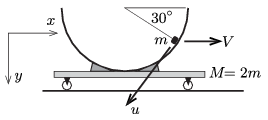

**Megoldás.**
 $a)$ Jelöljük a kiskocsi sebességét $V$-vel, a lecsúszó test kiskocsihoz viszonyított sebességének nagyságát pedig $u$-val. A kérdéses pillanatban a kis test sebessége vízszintes irányban
 $v_x=V-\frac{1}{2}u,$
 függőlegesen pedig
 $v_y=u\frac{\sqrt{3}}{2}.$
 (Kihasználtuk, hogy az $R/2$ süllyedéshez tartozó helyzetben a kis testhez húzott sugár $30^\circ$-os szöget zár be a vízszintessel.)

 A külső erők eredőjének nincs vízszintes irányú összetevője, emiatt a rendszer $x$ irányú impulzusa megmarad:
 $MV+m\left(V-\frac{1}{2}u\right)=0,$
 így ($M=2m$ felhasználásával)
 $V=\frac{1}{6}u.$
 Másrészt az energiamegmaradás törvénye szerint
 $\frac{1}{2}m\left(v_x^2+v_y^2 \right) +\frac{1}{2}M V^2=mg\frac{R}{2},$
 ahonnan
 $u=\sqrt{\frac{12}{11}Rg}=1{,}79~\frac{\rm m}{\rm s}; \qquad V=\sqrt{\frac{1}{33}Rg}=0{,}30~\frac{\rm m}{\rm s}$
 következik. Ennek megfelelően
 $v_x=-0{,}60~\frac{\rm m}{\rm s}; \qquad v_y=1{,}55~\frac{\rm m}{\rm s},$
 vagyis a kis test sebességének nagysága
 $\vert \boldsymbol v \vert=\sqrt{v_x^2+v_y^2}=1{,}66~\frac{\rm m}{\rm s},$
 és az iránya $\varphi=\text{arctg} \frac{v_y}{v_x}\approx 69^\circ$-os szöget zár be a vízszintessel.
 $b)$ A pálya legalsó pontjánál a fentebb számolt mennyiségek így alakulnak:
 $u= \sqrt{3Rg},\qquad V=\frac{1}{3}u,\qquad v_x=-\frac{2}{3}u, \qquad v_y=0.$
 A kiskocsi gyorsulása a kérdéses pillanatban nulla , így a hozzá rögzített vonatkoztatási rendszer (ebben a pillanatban) inerciarendszernek tekinthető. A test mozgásegyenlete:
 $N-mg = m\frac{u^2}{R},$
 hiszen ebben a rendszerben a kis test $R$ sugarú körpályán $u$ sebességgel halad. ($N$ a kocsi által kifejtett, függőlegesen felfelé mutató kényszererő.)
 A talajhoz rögzített koordináta-rendszerben a kis test $v_x=-\frac{2}{3}u$ pillanatnyi sebességgel mozog, pályájának görbületi sugara a pálya legalsó pontjában (jelöljük ezt $\varrho$-val) a keresett mennyiség. A mozgásegyenlet most:
 $N-mg=\frac{v_x^2}{\varrho},$
 ahol $N$ ugyanakkora, mint amit a másik vonatkoztatási rendszerben kiszámítottunk. A két egyenlet összevetéséből a
 $\varrho=\frac{v_x^2}{u^2}R=\frac{4}{9}R=0{,}133~\rm m $
 eredményt kapjuk.

