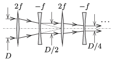

**Megoldás.**
 $a)$ Az optikai tengellyel párhuzamosan balról érkező fénysugarakat a gyüjtólencse $2f$ távolságban fókuszálná, ha nem lenne ott a szórólencse. Ez a pont a szórólencse jobb oldali fókuszpontja, tehát az oda tartó sugarakat párhuzamossá teszi, de ennek a nyalábnak az átmérője már csak $D/2$. A további lencsepárokon áthaladó fénnyel ugyanez történik, így a lencserendszert párhuzamos, $D/2^N$ átmérőjű nyaláb hagyja el.

 $b)$ A jobbról érkező sugárnyalábbal hasonló történik, de a nyaláb mérete minden lencsepár után a 2-szeresére nő, így a végén $2^N\,D$ lesz. (Természetesen a nyaláb átmérőjének a lencsék mérete határt szab.)

