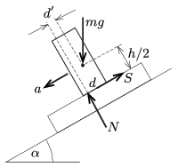

**I. megoldás.**
 A két doboz egyetlen testként $a=g(\sin\alpha-\mu \cos\alpha)$ gyorsulással lefelé mozog a lejtőn. A $m$ tömegű dobozra a függőlegesen lefelé mutató, $mg$ nagyságú nehézségi erő, a lejtővel párhuzamos $S$ súrlódási erő és a lejtőre merőleges $N$ nyomóerő hat. A mozgásegyenletek (lejtő irányában és arra merőlegesen):
 $mg\sin\alpha-S=ma,\qquad mg\cos\alpha-N=0,$
 ahonnan a gyorsulás ismert értékét behelyettesítve
 $S=\mu mg\cos\alpha, \qquad N=mg\cos\alpha.$

 A felső doboz nem jön forgásba, emiatt a rá ható erők eredő forgatónyomatéka a tömegközéppontjára nézve nulla kell legyen:
 $N\,d'-S\,\frac{h}{2}=0, \qquad \text{azaz} \qquad \mu=\frac{2d'}{h}.$
 Mivel az $N$ erő hatásvonala legfeljebb $d/2$ távolságban lehet a felső doboz (tömeg)középpontjától ($d'\le d/2$), fenn kell álljon, hogy $d\ge\mu h$.

**II. megoldás.**
 Írjuk fel a felső doboz egyensúlyának feltételét a dobozzal együtt mozgó koordináta-rendszerben. Ebben a gyorsuló rendszerben fellép egy $ma=mg\sin\alpha-\mu mg\cos\alpha$ nagyságú, a lejtő mentén felfelé mutató tehetetlenségi erő , amelynek a támadáspontja (éppúgy, mint a nehézségi erőé) a test tömegközéppontja. Az eredő erő lejtő irányú komponense $\mu mg\cos\alpha$, a lejtőre merőleges összetevő pedig $mg\cos\alpha$. Az eredő erő hatásvonala akkor esik a két doboz érintkezési felületére (akkor nem billen fel a felső doboz), ha fennáll, hogy
 $\frac{\mu mg\cos\alpha}{ mg\cos\alpha}=\mu \le\frac{d}{h}.$

 Megjegyzés. Érdekes, hogy a fel nem borulás feltétele sem a dobozok tömegétől, sem a lejtő hajlásszögétől nem függ. Ha a súrlódás nagyon kicsi, akkor még egy nagyon ,,karcsú'' ($d\ll h$) doboz sem borul fel, miközben csúszik lefelé egy (akár nagyon meredek) lejtőn.

