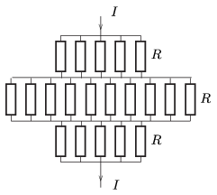

**Megoldás.**
 Az ikozaédernek 30 darab, egyenként $R$ ellenállású oldaléle van. Az áram be- és kivezetési pontján átmenő tengely körüli $2\pi/5$ szögű forgatásokra nézve a kapcsolás szimmetrikus (ötfogású szimmetria). Az elforgatással egymásba vihető csúcspontok ekvipotenciálisak, így akár össze is köthetők.

 Az így kapott helyettesítő kapcsolás (amelyen az ekvipotenciális pontok közötti ellenállásokat nem tüntettük fel) eredő ellenállása már könnyen számolható:
 $R_\text{eredő}=R\left( \frac{1}{5}+ \frac{1}{10}+ \frac{1}{5}\right)= \frac 12 \, R.$
 $b)$ $U$ feszültség esetén az ikozaéderen keresztül összesen
 $I=\frac{U}{R_\text{eredő}}=\frac{2U}{R}$
 áram folyik. A be- és kivezetési ponthoz közeli $5+5$ ellenálláson $\frac15I=\frac25\frac{U}{R}$ áram folyik, az egyes ellenállások teljesítménye: $\frac{4}{25}\frac{U^2}{R}.$
 A középső ellenállásréteg 10 tagján egyenként $\frac{1}{10}I$ áram folyik, és $\frac{1}{25}\frac{U^2}{R}$ teljesítmény jut rájuk. Az ekvipotenciális pontok között lévő ellenállásokon nem folyik áram, tehát a rájuk eső teljesítmény nulla.

