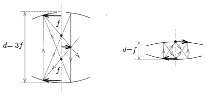
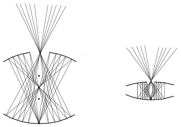

**Megoldás.**
 $a)$ Jelöljük a tükrök fókusztávolságát $f$-fel, az optikai tengely mentén mért távolságukat pedig $d$-vel. A felső tükör a $t_1=d$ távol lévő tárgyról a leképezési törvény szerint
 $k_1=\frac{df}{d-f}$
 távolságban alkot (valódi vagy látszólagos) képet. Ez a kép az alsó tükörtől
 $t_2=d-k_1=\frac{d(d-2f)}{d-f}$
 távol lévő tárgynak tekinthető, amelynek a képe (az alsó tükör felett)
 $k_2=\frac{t_2f}{t_2-f}=\frac{fd(d-2f)}{d^2-3fd+f^2}$
 magasságban képződik. A megadott feltétel szerint $k_2=d$, tehát
 $\frac{fd(d-2f)}{d^2-3fd+f^2}=d,$
 vagyis
 $d^2-4df+3f^2=0.$
 Ennek a másodfokú egyenletnek 2 valós gyöke van:
 $d_1=f=\frac12R \qquad \text{és} \qquad d_2=3f=\frac32R.$
 $b)$ A nagyítás
 $N=\frac{k_1}{t_1}\frac{k_2}{t_2}=\frac{f^2}{d^2-3fd+f^2}.$
 Ha $d=d_1=f$, akkor a nagyítás $-1$, tehát a kép fordított állású, ha pedig $d=d_2=3f$, akkor a nagyítás $+1$, tehát a kép egyenes állású. Mindkét esetben a kép valódi, vagyis ernyővel felfogható, de – megfelelő irányból nézve – szabad szemmel is látható. A képalkotás néhány nevezetes sugármenet segítségével könnyen megszerkeszthető.

 A szerkesztésnél használt segédvonalak nem mindegyike felel meg tényleges fénysugárnak, hiszen a felső tükör közepén egy lyuk van. Az alábbi ábrán a tárgy egy (az egyszerűség kedvéért az optikai tengelyen fekvő) pontjából kiinduló fénysugarakat ábrázoltuk a tükrök kétféle beállítása mellett. Látható, hogy az optikai tengely közelében van egy olyan tartomány, ahonnan nézve nem láthatjuk a lyuk közepén keletkező valódi képet (hanem csak az alsó tükör közepén lévő tárgyat). A furcsa, fent lebegni látszó képet csak kicsit ,,oldalról'' figyelhetjük meg.

