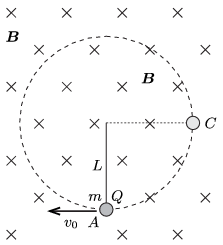

**Megoldás.**
 A mágneses Lorentz-erő merőleges a test sebességére (így nem végez munkát), iránya $Q>0$ és a megadott irányú mágneses indukció és sebesség esetén ,,kifelé'' mutat. Amikor a fonál $\alpha$ szöget zár be a függőlegessel, a golyó sebessége (az energiamegmaradás törvénye szerint)
 $v=\sqrt{v_0^2-2Lg(1-\cos\alpha)},$
 éppen ugyanakkora, mint amekkora mágneses tér nélküli esetben lenne. A megadott nagyságú $v_0$ mellett a sebesség így is felírható:
 $v(\alpha)=\frac{3}{2}\sqrt{Lg}\sqrt{1+\frac{8}{9}\cos\alpha}.$

 A test mozgásegyenlete (pontosabban annak sugár irányú komponense) az ábrán látható helyzetben:
 $K-mg\cos\alpha-QvB=\frac{mv^2}{L},$
 amibe $v(\alpha)$ fentebb kiszámított kifejezését beírva a fonalat feszítő erőre a
 $K(\alpha)=mg\left( 3\cos\alpha+\frac{9}{4}+\frac{QB}{2mg}\sqrt{Lg(9+8\cos\alpha)}\right)
$
 kifejezést kapjuk. Ez a függvény a $0<\alpha<180^\circ$ intervallumban monoton csökken, tehát ha még a pálya tetőpontján $\alpha=180^\circ$-nál sem válik negatívvá, akkor a körpálya más részén sem lazulhat meg a fonál.
 $a)$ Mivel $v_0$ megadott értéke az a legkisebb kezdősebesség, amellyel indítva a testet a fonál még éppen nem lazul meg sehol, ebben a határesetben $K(180^\circ)=0$ teljesül. Eszerint a mágneses indukció nagysága
 $B=\frac{3}{2}\,\frac{mg}{Q\sqrt{Lg}},$
 és a fonalat feszítő erő tetszőleges helyzetben
 $K(\alpha)=mg\left( 3\cos\alpha+\frac{9}{4}+\frac{3}{4}\sqrt{9+8\cos\alpha}\right).
$
 $b)$ A fonálerő a $C$ pontban ($\alpha=0$ esetén)
 $K_A=\frac{21+3\sqrt{17}}{4}mg\approx 8{,}3\,mg,$
 a $C$ pontban ($\alpha=90^\circ$-os szögnél) pedig
 $K_C=\frac{9}{2}\,mg=4{,}5\,mg,$
 a kérdezett arány tahát
 $\frac{K_A}{K_C}=\frac{21+3\sqrt{17}}{18}\approx 1{,}8.$

