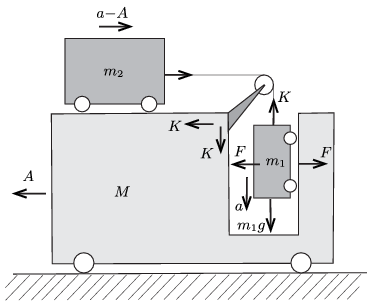

**Megoldás.**
 Jelöljük a testekre ható erőket és a testek gyorsulását az ábrán látható módon! (Az $m_2$ tömegű kiskocsi a $M$ tömegű kocsikoz képest $a$, a talajhoz képest tehát $a-A$ gyorsulással mozog.)

 A mozgásegyenletek:
 $m_1g-K=m_1a,$
 $K-F=MA,$
 $K=m_2(a-A),$
 $F=m_1A.$
 Az egyenletrendszer megoldása:
 $A=\frac{m_1m_2}{m_1\left(m_1+m_2+M\right)+m_2\left(m_1+M\right) }\,g,$
 $a=\frac{m_1\left(m_1+m_2+M\right) }{m_1\left(m_1+m_2+M\right)+m_2\left(m_1+M\right) }\,g.$
 $a)$ A megadott tömegek esetén
 $A=\frac{1}{10}g=0{,}98~\frac{\rm m}{\rm s^2}\approx 1{,}0 ~\frac{\rm m}{\rm s^2},$
 $a=\frac{2}{5}g=3{,}92~\frac{\rm m}{\rm s^2}\approx 4{,}0 ~\frac{\rm m}{\rm s^2},$
 $a-A=\frac{3}{10}g=2{,}94~\frac{\rm m}{\rm s^2}\approx 3{,}0 ~\frac{\rm m}{\rm s^2}.$
 $b)$ Az $M$ tömegű kiskocsi gyorsulása így is felírható:
 $A=\frac{g}{2+\frac{m_1}{m_2}+\frac{M}{m_1}+\frac{M}{m_2}}.$
 Látható, hogy
 $0<A<\frac{g}{2} .$
 Az $A\approx \tfrac12 g$ felső korlát akkor közelíthető meg, ha $M\ll m_1 \ll m_2$. Ebben a határesetben $F\approx K\approx \frac{1}{2}m_2g$ és $a\approx A$.

