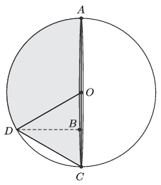

**Megoldás.**
 A gömbök mérete a közöttük lévő távolsághoz képest olyan kicsi, hogy a két test pontszerűnek tekinthető. Amikor $x$ távolságra vannak a felezőpontjuktól (tömegközéppontjuktól), közöttük
 $F(x)=k\frac{Q_1Q_2}{(2x)^2}$
 erő hat, a gyorsulásuk tehát
 $a(x)=-\frac{K}{x^2},\qquad \text{ahol}\qquad K=k\frac{Q_1\,\vert Q_2\vert}{4m}=4{,}5\cdot 10^{-8}~\frac{\rm m^3}{\rm s^2}.$
 A töltött testek a Kepler-törvényeknek megfelelően mozognak, hiszen a mozgásegyenletük ugyanolyan, mint a bolygómozgásé. A gömbök pályája két olyan elfajult ellipszis, amelyek nagytengelye 0,5 m, kistengelye (határesetben) nulla. Mindkét test a fókuszponttól mért $x_1=\tfrac12$ m távolságból indulva eljut $x_2=\tfrac18$ m-nyire.

 Ha a töltött gömb $R=\tfrac14$ m sugarú körpályán mozogna a vonzócentrum körül, akkor a keringési ideje
 $T_0=2\pi \sqrt{\frac{R^3}{K} }=61{,}7~\text{perc}$
 lenne. Kepler III. törvénye szerint ugyanennyi idő alatt futná be a töltött test a teljes (elfajult) ellipszispályát, hiszen annak nagytengelye ugyancsak 0,5 méter. De mivel az ellipszispályának csak az $AB$ szakaszát futja be a test, ennek ideje (Kepler II. törvénye szerint) annyiszor kisebb $T_0$-nál, ahányszor kisebb területet súrol az ellipszis $C$ fókuszpontjából húzott vezérsugár, mint az ellipszis teljes területe. Ha az ellipszist arányos nyújtással körré alakítjuk, a területek aránya nem változik. Az ábráról leolvasható, hogy a területarány (az $OAD$ körcikk és az $ODC$ szabályos háromszög területének összege, valamint a teljes kör területének hányadosa):
 $\frac{(\pi/3)+(\sqrt{3}/4)}{\pi}=0{,}471,$
 a keresett idő tehát
 $T=0{,}471\cdot T_0\approx 29~\text{perc}.$
 Ugyanezt az eredményt úgy is megkaphatjuk, hogy felírjuk a mozgásegyenletből leolvasható energiatételt:
 $\frac12 v^2=K\left(\frac{1}{x}-\frac{1}{0{,}5~\rm m}\right),$
 ahonnan (SI egységekben)
 $v(x)=\sqrt{\frac{2K(1-2x)}{x}}.
$
 Ennek reciprokát integrálva (az integrálást pl. a www.wolframalpha.com program segítségével számolva) a mozgás időtartamára a
 $T=\int_{1/8}^{1/2} \frac{1}{v(x)}\,{\rm d}x=1744~{\rm s}\approx 29~\text{perc}
$
 eredményt kapjuk.

