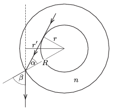

**Megoldás.**
 Ha az üvegpohár fala vékony, akkor az ábrán látható sugármenet határozza meg a fémhenger méretének látszólagos megnövekedését.

 A törési törvény szerint
 $\sin\beta=\frac{r'}{R}=n\sin\alpha=n\frac{r}{R},$
 ahonnan
 $r'=nr=3{,}75~\rm cm.$
 A henger átmérőjének látszólagos növekedése $2(r'-r)=2{,}5$ cm.
 Érdekes, hogy $r'$ (az adott közelítésben) nem függ $R$-től, amennyiben $nr'<R$ teljesül.
 Megjegyzés: A fény törése miatt egy kicsit a fémhenger ,,mögé'' is látunk.

