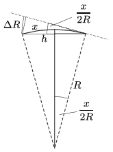

**Megoldás.**
 Ismert, hogy a Nap-Föld távolság
 $R=1~\text{csillagászati egység} =1~{\rm CsE}= 150~\text{millió km}.$
 A jó közelítéssel kör alakú pálya $2R\pi$ hosszú kerületét 1 év alatt teszi meg a Föld, sebessége tehát
 $v=2R\pi/T=30~\rm km/s.$
 A Föld $t=1$ másodperc alatt $x=vt=30~$km-t tesz meg, miközben egy kicsit eltér a kör érintőjétől (vagyis az egyenes iránytól). Az eltérést többféle módon is kiszámíthatjuk.
 $(i)$ Ha egyenesen haladna a Föld, $x$ elmozdulás után $\sqrt{R^2+x^2}$ távol kerülne a Naptól, de a körpályán a távolsága ténylegesen $R$ marad. Az eltérés nagysága
 $\Delta R=\sqrt{R^2+x^2}-R= \sqrt{150\,000\,000^2+30^2}-150\,000\,000.$
 Sajnos ezt a mennyiséget közvetlen számolással nem tudjuk kiszámítani, mert a négyzetgyök értéke a zsebszámológépek pontossága erejéig éppen 1 CsE, tehát az eltérés numerikusan nullának adódik.
 Ügyesebben is eljárhatunk, ha a keresett mennyiséget megszorozzuk és el is osztjuk egy megfelelően választott kifejezéssel:
 $\Delta R=\frac{\left(\sqrt{R^2+x^2}-R\right)\cdot \left(\sqrt{R^2+x^2}+R\right)}{\left(\sqrt{R^2+x^2}+R\right)}.$
 A számláló $(R^2+x^2)-R^2=x^2,$ a nevező pedig jó közelítéssel $2R$, az eltérés tehát
 $\Delta R\approx \frac{x^2}{2R}=\frac{(30~\rm km)^2}{3\cdot 10^6~\rm km}=3~\rm mm.$
 $(ii)$ Geometriai megfontolásokkal is megkaphatjuk a keresett távolságot. A Föld $x$ hosszúságú elmozdulása során a Föld jó közelítéssel $x$ távolságra kerül az eredeti helyzetétől (ha a húr $h$ hosszát a körív $x$ hosszával közelítjük). Ezalatt a Földet a Nappal összekötő egyenes $x/R$ szöggel fordul el, a kör érintője tehát a kiindulási pontban $x/(2R)$ szöget zár be a kör húrjával. Így a Föld eltávolodása az érintő egyenesétől (az egyenesen mért távolságot az $x$ sugarú, $x/(2R)$ középponti szögű körív hosszával közelítve):
 $\Delta R\approx \frac{x^2}{2R}=3~\rm mm.$

 $(iii)$ Az eltérést a Föld centripetális gyorsulásából is kiszámíthatjuk. A $v$ sebességgel mozgó Föld $a=v^2/R$ gyorsulással ,,esik'' a Nap felé, $t=1~$s alatt tehát
 $\Delta R=\frac{a}{2}t^2=\frac{v^2}{2R}t^2=\frac{x^2}{2R}=3~\rm mm$
 távol kerül a kört érintő egyenestől.

