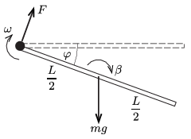
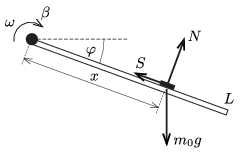

**Megoldás.**
 Számítsuk ki az $m$ tömegű és $L=1$ m hosszúságú rúd $\omega$ szögsebességét és $\beta$ szöggyorsulását abban (az 1. ábrán látható) helyzetben, amikor az elfordulása az eredeti helyzetéhez képest $\varphi$.

 1. ábra

 Ha a tengelynél ható erőnek a rúdra merőleges komponense $F$, akkor a forgómozgás alapegyenlete szerint
 $F\frac{L}{2}=\frac{1}{12}mL^2\beta,$
 a tömegközéppont mozgásegyenlete pedig (a rúdra merőleges irányban):
 $mg\cos\varphi-F=m\frac{L}{2}\beta.$
 Ezekből $F$ kiküszöbölése után
 $\beta=\frac{3g}{2L}\cos\varphi$
 adódik. (A rúd viszonylag nagy tömege miatt a pénzérmék tehetetlenségi nyomatékát és a pénzérmék által a rúdra kifejtett erőket nem vettük figyelembe.)
 A rúd szögsebessége az energiamegmaradás törvényét alkalmazva határozható meg.
 $mg\frac{L}{2}\sin\varphi=\frac{mL^2}{3}\,\frac{\omega^2}{2},$
 vagyis
 $\omega^2=\frac{3g}{L}\sin\varphi.$

 Megjegyzés. A szögsebesség négyzetét megadó egyenletből (annak mindkét oldalát az idő szerint deriválva) közvetlenül is megkaphatjuk a szöggyorsulát.

 Tekintsük azt a pénzérmét, amelyik a tengelytől $x$ távolságra helyezkedik el, és számítsuk ki, mekkora $N$ nyomóerőt és mekkora $S$ súrlódási erőt fejt ki rá a rúd a $\varphi$ szögű helyzetben ( 2. ábra ). (Legyen a pénzérme tömege $m_0$, mérete a rúd méretéhez képest elhanyagolható.)

 2. ábra

 A pénzérmére felírható mozgásegyenletek (a korábban kiszámított $\beta$ és $\omega^2$ felhasználásával:
 $m_0g\cos\varphi-N=mx\beta, \qquad S-m_0g\sin\varphi=mx\omega^2,$
 ahonnan
 $N(\varphi)=m_0g\cos\varphi\left(1-\frac{3x}{2L}\right),$
 $S(\varphi)=m_0g\sin\varphi\left(1+\frac{3x}{L}\right).$
 A pénzérmék csak akkor mozoghatnak a fentebb leírt módon, ha $S\le \mu N$, ellenkező esetben a pénzérme megcsúszik a rúdon, illetve ha $N\ge 0$, ellenkező esetben a pénz elválik a rúdtól, lerepül róla.
 $a)$ Az indulás pillanatában $\varphi=0$, tehát $S=0$ és $N=m_0g\left(1-\frac{3x}{2L}\right).$ Ezek szerint egyik pénz sem csúszik el a rúdon, viszont azok, amelyekre $x>\tfrac{2}{3}L\approx 67$ cm, vagyis a 70, 80, 90 és 100 centiméteres jelekhez tett 5 forintosok eltávolodnak a rúdtól, lerepülnek arról.
 $b)$ A $\varphi=10^\circ$-os helyzetben azok a pénzek nem csúsznak meg, amelyekre
 $\frac{S}{N}=\tan10^\circ\,\frac{2L+6x}{2L-3x}\le 0{,}5;$
 azaz $x\le 0{,}25$ m. Tehát csak a forgástengelynél, illetve a 10 és a 20 cm-es jeleknél elhelyezett 5 forintosok maradhatnak a rúdon eddig az elfordulásig, a többiek már korábban megcsúsztak a méterrúdon.

