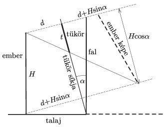

**Megoldás.**
 Az ábrán látható hasonló háromszögekből
 $\frac{t}{d}=\frac{H\cos\alpha}{2d+H\sin\alpha},$
 ahonnan a szükséges tükörméret:
 $t=\frac{H}{2}\frac{\cos\alpha}{1+\frac{H}{2d}\sin\alpha}.$

 Az eredmény azt mutatja, hogy növekvő $\alpha$ szögek esetén a szükséges tükörméret csökken, azonban a méret függ az ember helyzetétől is (kivéve az $\alpha=0$ határesetet. Az ábra azt is jól mutatja, hogy növekvő $\alpha$ szögek esetén a kép torzulása is növekszik.
 (A megoldásban elhanyagoltuk az ember szeme és a feje teteje közötti távolságot.)

