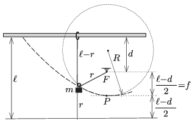

**Megoldás.**
 $a)$ Amikor az $m$ tömegű test a pályájának legmélyebb pontjánál van, akkor mindkét fonálszál függőleges, és a csiga $\tfrac12(\ell+d)$ távolságra kerül a rúdtól. Az energiamegmaradás tétele szerint a test sebessége ekkor
 $v=\sqrt{g(\ell+d)}.$
 $b)$ A mozgás során a fonál egyik része mindvégig függőleges. (Ha nem így lenne, akkor vízszintes irányú erőt is kifejtene a gyűrűre, és az a kicsiny tömege miatt nagyon nagy gyorsulással mozogna.)
 Vegyünk fel a rúddal párhuzamosan, a rúd alatt, attól $\ell$ távolságban egy segédegyenest, az ábrán látható módon. Mozgása során a csiga mindig ugyanolyan messze lesz ettől az egyenestől, mint amilyen távol van az $F$ ponttól, a fonál rögzített végpontjától.
 Ezek szerint a pályagörbe parabola, melynek fókuszpontja $F$, fókusztávolsága
 $f=\frac{\ell-d}{2}.$

 $c)$ Ha a pálya legalsó, $P$-vel jelölt pontjában a fonalat feszítő erő $K$, akkor a test mozgásegyenlete:
 $2K-mg=\frac{mv^2}{R},$
 ahol $R$ a parabola görbületi sugara a $P$ pontban..
 Az optikából ismert, hogy egy $R$ sugarú gömbtükör fókusztávolsága közelítőleg $R/2$. Ebből következik, hogy a parabolát legjobban közelítő kör (a simulókör) sugara
 $R=2f=\ell-d,$
 és így a keresett fonálerő:
 $K=\frac{1}{2}\left(mg+\frac{mg(\ell+d)}{\ell-d}\right)=mg\frac{\ell}{\ell-d}.$

