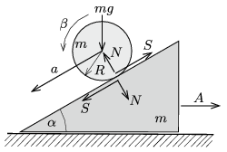

**Megoldás.**
 Jelöljük az ék vízszintes gyorsulását (jobbra) $A$-val, a henger gyorsulását az ékhez viszonyítva $a$-val, a henger szöggyorsulását $\beta$-val, a tapadó súrlódási erőt $S$-sel, végül a henger és az ék közötti nyomóerőt $N$-nel (lásd az ábrát ).

 A következő mozgásegyenleteket írhatjuk fel:
 $SR=\frac{1}{2}mR^2\beta,$
 $N\sin\alpha-S\cos\alpha=mA,$
 $mg-S\sin\alpha-N\cos\alpha=ma\sin\alpha,$
 $N\sin\alpha-S\cos\alpha=m(a\cos\alpha-A),$
 továbbá a tiszta (csúszásmentes) gördülés feltételét:
 $a-R\beta=0.$
 Ezekből az egyenletekből következik, hogy
 $A=\frac{\cos\alpha \,\sin\alpha}{3\sin^2\alpha+2\cos^2\alpha}g=\frac{g}{\sqrt{27}}=1{,}89~\frac{\rm m}{\rm s^2},$
 $a=\frac{2\sin\alpha}{3\sin^2\alpha+2\cos^2\alpha}g=\frac{4g}{9}=4{,}36~\frac{\rm m}{\rm s^2},$
 $S=\frac{\sin\alpha}{3\sin^2\alpha+2\cos^2\alpha}mg=\frac{2}{9}mg,$
 $N=\frac{2\cos\alpha}{3\sin^2\alpha+2\cos^2\alpha}mg=\frac{4}{\sqrt{27}}mg.$
 A csúszásmentes gördülés feltétele:
 $\mu\ge \frac{S}{N}= \frac{1}{2}\tan\alpha=\frac{1}{\sqrt{12}}\approx 0{,}29.$

