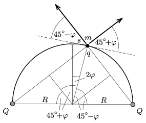

**Megoldás.**
 A gyöngy a félkörív felezőpontjában, a rögzített ponttöltésektől egyenlő távolságban lehet egyensúlyban. Térítsük ki a gyöngyöt ebből az egyensúlyi helyzetből egy kicsiny, a félkörív mentén mért $s$ elmozdulással ($s\ll R$), és jelöljük a félkörív középpontjához húzott sugár szögének elfordulását $2\varphi$-vel ($\varphi\ll 1)$. Az elmozdulás és a szögelfordulás közötti kapcsolat: $s=2R\varphi$.

 Számítsuk ki a kicsit kimozdított gyöngyre ható eredő erő érintő irányú komponensét! A Coulomb-törvény szerint (az ábrán jelölt távolságok és szögek ismeretében)
 $F(s)=k\frac{qQ}{4R^2}\left[ \frac{\cos(45^\circ+\varphi)}{\sin^2(45^\circ+\varphi)}-\frac{\cos(45^\circ-\varphi)}{\sin^2(45^\circ-\varphi)} \right].$
 A szögletes zárójelben álló kifejezés az addíciós tételek szerint így írható:
 $[\ldots]=-\sqrt{2}\frac{6\cos^2\varphi\sin\varphi+2\sin^3\varphi}{\left(\cos^2\varphi-\sin^2\varphi\right)^2},$
 ami $\varphi\ll 1$ miatt ($\cos\varphi\approx 1$ és $\sin\varphi\approx \varphi$ közelítésekkel, valamint a $\varphi$ szög 1-nél magasabb kitevőjű hatványainak elhanyagolásával) a következő egyszerű alakot ölti:
 $[\ldots]\approx -6\sqrt{2}\, \varphi.$
 A gyöngyszemet visszahúzó eredő erő tehát
 $F(s)=-D\,s,\qquad \text{ahol} \qquad D= \frac{3kqQ}{\sqrt{8}R^3}.$
 Ez megegyezik egy $D$ direkciós erejű rugó által kifejtett erővel, a gyöngyszem mozgása tehát harmonikus rezgőmozgás lesz
 $T=2\pi \sqrt{\frac{\sqrt{8}mR^3}{3kqQ}}$
 periódusidővel.

