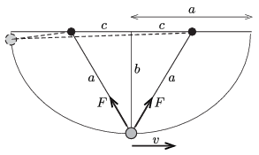

**Megoldás.**
 Jelöljük a fonál hosszát $2a$-val, a felfüggesztési pontok távolságát $2c$-vel, és legyen $b=\sqrt{a^2-c^2}.$ Esetünkben $a=4$ m, $c=2~$m és $b=3{,}46~$m.
 A test pályája egy olyan ellipszis, amelynek vízszintes nagytengelye $2a$, függőleges kistengelye $2b$ és a $2c$ távolságban lévő fókuszpontjai a fonál felfüggesztési pontjai.

 A test sebessége a pálya legmélyebb pontjában (ez a maximális sebessége) az energiatétel szerint
 $\frac{1}{2}mv^2=mgb, \qquad v=\sqrt{2gb}.$
 A Newton-féle mozgásegyenlet alapján
 $2F\frac{b}{a}-mg=\frac{mv^2}{R},$
 ahol $F$ a fonalat feszítő erő, $R$ pedig az ellipszis görbületi sugara a kistengely végpontjában. Belátható (például két egymásra merőleges irányú, azonos körfrekvenciájú, $90^\circ$-os fáziseltolódású harmonikus rezgőmozgás sebesség és gyorsulás képleteiből), hogy $R=a^2/b$.
 A fenti összefüggésekből kifejezhető a keresett erő:
 $F= mg \frac{a^2+2b^2}{2ab}=1{,}44\,mg=7{,}1~\rm N.$

