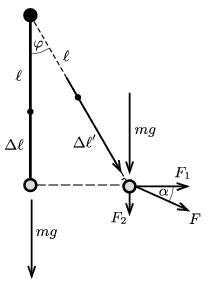

**Megoldás.**
 Ha a testet nem húzzuk, a nehézségi erő és a gumiszál rugalmas ereje tart egyensúlyt. A gumi megnyúlása ilyenkor $\Delta\ell=mg/D$.
 Ha a gumifonalat $\varphi$ szöggel kitérítjük vízszintesen, akkor a hossza
 $\ell+\Delta\ell'=\left(\ell+\frac{mg}{D}\right)\frac{1}{\cos\varphi},$
 a megnyúlása
 $\Delta\ell'=\frac{mg}{D}\frac{1}{\cos\varphi}+\ell\left(\frac{1}{\cos\varphi}-1\right),$
 a benne ébredő rugalmas erő pedig
 $F=D\Delta\ell'=\frac{mg}{\cos\varphi}+D\ell\left(\frac{1}{\cos\varphi}-1\right)
$
 lesz.

 A rugalmas erő és a nehézségi erő eredőjével tart egyensúlyt a külső erő. Ennek vízszintes komponense
 $F_1=F\sin\varphi=\left(mg+D\ell(1-\cos\varphi)\right)\tan\varphi=2{,}65~\rm N,$
 a függőleges komponens pedig
 $F_2=F\cos\varphi-mg=D\ell(1-\cos\varphi)=0{,}67~\rm N.$
 A kitérítő erő nagysága tehát
 $F=\sqrt{F_1^2+F_2^2}=2{,}73~\rm N,$
 iránya pedig $\alpha=\arctan\frac{F_2}{F_1}=14{,}2^\circ$-ot zár be a vízszintessel, és ferdén lefelé mutat.

