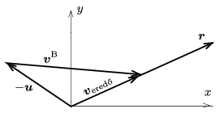
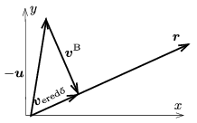

**I. megoldás.**
 Vegyünk fel egy olyan koordináta-rendszert, amelynek origója a fiúk vállánál van, $x$ tengelye vízszintes, $y$ tengelye függőlegesen felfelé mutat. Bendegúz hógolyójának kezdősebessége legyen vízszintes irányban $v^{\rm B}_x$, függőlegesen $v^{\rm B}_y$, és a földet éréséig eltelő idő pedig $t$. (Ez a három mennyiség pillanatnyilag még nem ismert.)
 András hógolyója
 $v^{\rm A}_x=v_0\cos\alpha= 8{,}66 ~{\rm m/s} \qquad \text{és}\qquad v^{\rm A}_y=v_0\sin\alpha= 5{,}00 ~{\rm m/s}$
 kezdősebességgel indul, és $t_0+t$ idő alatt vízszintes irányban
 $(1)$ $d=v^{\rm A}_x(t+t_0),$
 függőlegesen pedig
 $(2)$ $v^{\rm A}_y(t+t_0)-\frac{g}{2}(t+t_0)^2=-h$
 ,,magasságba'' kerül.
 A (2) egyenletből kiszámíthatjuk, hogy
 $t+t_0=
1{,}19~{\rm s}, \qquad \text{vagyis}\qquad t=0{,}69~{\rm s},$
 az (1) egyenletből pedig $d=10{,}3 ~\rm m$ adódik.
 Tételezzük fel, hogy a két hógolyó közvetlenül a leesésük pillanatában találkozik. (Belátható, hogy Bendegúz ebben az esetben kell a legkisebb sebességgel eldobja a hógolyóját.) Ekkor felírható, hogy
 $(3)$ $d=v^{\rm B}_xt, $
 továbbá
 $(4)$ $v^{\rm B}_yt -\frac{g}{2}t^2=-h.$
 Ezekből
 $v^{\rm B}_x=14{,}9 ~{\rm m/s} \qquad \text{és}\qquad v^{\rm B}_9=1 {,}93 ~{\rm m/s},
$
 Bendegúz dobásának kezdősebességére pedig
 $v^{\rm B}=\sqrt{\left(v^{\rm B}_x\right)^2+ \left(v^{\rm B}_y\right)^2} =15 {,}0 ~{\rm m/s} $
 adódik.

**II. megoldás.**
 András hólyolyója $t_0$ idő alatt az
 $(5)$ $x=v^{\rm A}_x t_0 , \qquad y=v^{\rm A}_y t_0 -\frac{g}{2} t_0 ^2$
 koordinátájú helyen lesz, és a sebessége
 $u_x=v^{\rm A}_x, \qquad u_y=v^{\rm A}_y -gt_0.$
 Üljünk bele a $t_0$ pillanatban az András hógolyójához rögzített (szabadon eső, tehát lefelé gyorsuló) koordináta-rendszerbe! Ebben a rendszerben mindkét hógolyó ,,súlytalan'', András hógolyója áll, Bendegúzé pedig egyenes vonalú egyenletes mozgást végez, és még azelőtt el kell érnie Andrásét, mielőtt az leesne a földre. Bendegúz a hógolyó eldobásának pillanatában $\left(-u_x, -u_y\right)$ sebességgel mozog, az általa eldobott hógolyó sebessége tehát
 $\left(-u_x+v_x^{\rm B}, -u_y+v_y^{\rm B}\right)$
 lesz. Ezzel a sebességgel akkor jut el $t$ idő alatt az (5) által megadott $(x,y)$ pontba, ha fennáll:
 $(6)$ $\left(v^{\rm B}_x-v^{\rm A}_x\right)t=v^{\rm A}_x t_0,$
 illetve
 $(7)$ $\left(v_y^{\rm B}-v^{\rm A}_y +gt_0\right)t=v^{\rm A}_y t_0 -\frac{g}{2} t_0 ^2.$
 Ez a két egyenlet egyenértékű az I. megoldás (1) és (3), illetve (2) és (4) egyenletének különbségével.

 1. ábra

 A hógolyók összeütközésének pillanata nem lehet későbbi, mint amikor azok földet érnek. Az 1. ábrán láthatjuk a (6) és (7) egyenletek vektoros szemléltetését abban az esetben, ha $-\boldsymbol{u}$ és $\boldsymbol{r}$ tompaszöget zárnak be egymással. (A feladat számadatai mellett ez a helyzet.) Bendegúz hógolyójának András hógolyójához viszonyított sebessége
 $\boldsymbol{v}_\text{eredő}= -\boldsymbol{u}+\boldsymbol{v}^{\rm B}.$
 Ennek nagysága annál kisebb (tehát annál később következik be az összeütközés), minél kisebb $v_B$. A $t$ időtartamnak korlátot szab a földet érés, tehát a legkisebb $v_B$ a leghosszabb idejű mozgásnál, a földfelszínen történő összeütközés felel meg.
 Megjegyzés. Elképzelhetők olyan $\alpha$, $v_0$ és $t_0$ adatok, hogy $-\boldsymbol{u}$ és $\boldsymbol{r}$ hegyesszöget zárnak be egymással ( 2. ábra ). (Ez csak akkor következhet be, ha $\sin^2\alpha>8/9$, vagyis $\alpha>70{,}5^\circ$). A feladatban szereplő 30$^\circ$-os szög nem teljesíti ezt a feltételt.

 2. ábra

 Ilyen (hegyesszögű) esetben Bendegúz hógolyójának minimális nagyságú kezdősebessége a 2. ábrán látható merőleges szerkesztésével kapható meg. Természetesen teljesülnie kell még annak is, hogy ezen helyzetnek megfelelő időtartam alatt a hógolyók még nem estek le a földre, vagyis $h$ ,,elegendően'' nagy.
 A ,,hegyesszögű'' esetre nyilvánvaló (triviális) példa, amikor András majdnem pontosan függőlegesen felfelé dobja el a hógolyót. Ilyenkor Bendegúz legjobb stratégiája az, ha akkor dobja el a saját hógolyóját, amikor a másik a legközelebb ér hozzá (majdnem a fejére esik).

