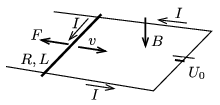

**Megoldás.**
 Jelöljük a fémpálcát egyenletes sebességgel mozgató ember által kifejtett erőt $F$-fel, a pálcán, a síneken és a telepen átfolyó áram erősséget pedig $I$-vel, az ábrán jelölt irányokat tekintve pozitívnak. (Ha az áram vagy az erő tényleges iránya az ábrán jelölttel ellentétes lenne, azt a megfelelő fizikai mennyiségek negatív előjele fogja jelezni.)
 A mozgó fémpálcában $U_1=BLv$ nagyságú feszültség indukálódik, ami (és a telep feszültsége) együttesen
 $I=\frac{U_0-BLv}{R}$
 áramot hoz létre. Az áramjárta, mozgó pálcára a mágneses mező $F=BIL$ nagyságú erőt fejt ki, ami ($I>0$ esetén) a telep irányába húzza a pálcát. Az egyenletes mozgás fenntartásához a pálcát mozgató embernek a teleppel ellentétes irányban, balra kell húznia a fémpálcát, ahogy azt az ábra mutatja.

 Az ember által kifejtett teljesítmény:
 $P_\text{ember}=-Fv=-BILv=\frac{BLv-U_0}{R}BLv=\frac{(BLv)^2 }{R}-\frac{BLv}{R} U_0.$
 Másrészt a telep által leadott teljesítmény:
 $P_\text{telep}=U_0I=\frac{U_0^2}{R}-\frac{BLv}{R} U_0.$
 Ennek a két teljesítménynek az összege éppen az $R$ ellenálláson időegységenként fejlődő Joule-hővel egyezik meg:
 $P_\text{ember}+ P_\text{telep}=\frac{(U_0-BLv)^2}{R}=I^2R=P_\text{Joule},$
 tehát a munkatétel általánosított alakja a jelen esetben is teljesül.
 $a)$ $v=1$ m/s esetén $I=1{,}0~\rm A$, $F=0{,}1~\rm N$, így
 $P_\text{ember}=-0{,}1~{\rm W};\qquad P_\text{telep}=+0{,}3~{\rm W};\qquad P_\text{Joule}=+0{,}2~{\rm W}.$
 A telep több munkát végez, mint a fejlődő Joule-hő, a különbözet az emberen végzett munkával egyezik meg.
 $b)$ $v=5$ m/s esetén $I=-1{,}0~\rm A$, $F=-0{,}1~\rm N$, továbbá
 $P_\text{ember}= 0{,}5~{\rm W};\qquad P_\text{telep}=-0{,}3~{\rm W};\qquad P_\text{Joule}=+0{,}2~{\rm W}.$
 Az ember most több munkát végez, mint a Joule-hő, a különbözetet a telep (akkumulátor) veszi fel, annak energiáját növeli.

