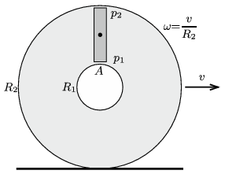

**Megoldás.**
 Legyen az autógumi belső sugara $R_1$, a külső sugara $R_2$, a levegő (átlagos) sűrűsége
 $\varrho=3\varrho_\text{normál}\approx 4~\frac{\rm kg}{\rm m^3},$
 az autó sebessége pedig $v\approx 36~$m/s. ($\varrho_\text{normál}$ a normál légköri nyomáshoz tartozó sűrűség.)

 Tekintsük az autógumiban lévő $A$ keresztmetszetű, $R_2-R_1$ magas, hasáb alakú levegő mozgását! Ennek a levegődarabnak a tömege $m=\varrho A(R_2-R_1),$ tömegközéppontjának gyorsulása
 $a=\frac{R_1+R_2}{2}\omega^2=\frac{R_1+R_2}{2}\,\frac{v^2}{R_2^2},$
 a rá ható eredő erő pedig
 $F=p_2A-p_1A,$
 ahol $p_1$ és $p_2$ a levegő nyomása a belső, illetve a külső sugár mentén.
 Az $F=ma$ mozgásegyenlet szerint
 $p_2-p_1=\frac{R_2^2-R_1^2}{2R_2^2} \varrho v^2.$
 Ha a becslés során pl. az $R_2\approx 3R_1$ méretarányt választjuk, a nyomáskülönbségre
 $\Delta p\approx 2~\rm kPa$
 adódik, ami a légköri nyomásnak mindössze 2 százaléka.

 Megjegyzés. A megfontolásunk során elhanyagoltuk az autógumiban lévő levegő sűrűségének változását, a levegő felmelegedését, valamint a gumi görbültségét a belső és a külső sugaraknál.

