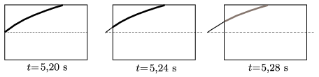
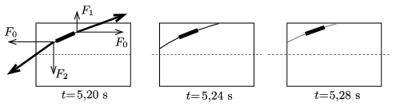

**I. megoldás.**
 Hosszabbítsuk meg a filmkockákon látható hullámalakokat egészen addig, hogy feltűnjenek az adott pillanatbeli nulla kitéréshez tartozó csomópontok .

 Az ábrán látszik, hogy a csomópont fokozatosan balra tolódik el, a hullámok tehát balra haladnak. Ez a megállapítás tulajdonképpen az azonos fázisú pontok haladási irányára (az ún. fázissebességre) vonatkozik, de ha nem lép fel diszperzió (vagyis a különböző frekvenciájú hullámok fázissebessége ugyanakkora), akkor a fázissebesség megegyezik a hullámvonulat egészének haladási sebességével, az ún. csoportsebességgel. A csoportsebesség mutatja meg, hogy a hullám milyen irányban és milyen gyorsan szállítja az energiát. Esetünkben tehát az energia jobbról balra terjed a gumikötélben, ilyen irányban szállítják a hullámok az energiát.

**II. megoldás.**
 Tekintsük a gumikötélnek egy kicsiny, a filmfelvétel képein vastagon jelölt darabkáját!

 Ez a kötéldarab a bemutatott három filmkockán alulról felfelé mozdul el. (A vízszintes irányú elmozdulása elhanyagolhatóan kicsi, amennyiben a kötél csak kicsit tér el az egyensúlyi állapotától, az ábrákon szaggatottan jelölt egyenestől. A képeken ez nem teljesül, azok – a jobb áttekinthetőség kedvéért – erősen torzítottak.)
 A kis kötéldarabra a tőle jobbra és a tőle balra lévő kötelek fejtenek ki erőt. (A nehézségi erőt egy erősen kifeszített gumikötélnél elhanyagolhatjuk a rugalmas erők mellett.) Mindkét kötélerő vízszintes komponense $F_0$, ezek eredője jó közelítéssel nulla, összhangban azzal a megállapítással, hogy a kötéldarab vízszintes irányban nem mozdul el. A jobb oldali kötél $F_1$ erővel húzza a kis kötéldarabot felfelé, a pillanatnyi sebességével megegyező irányban. Így a jobb oldali kötélrész munkát végez a kis kötéldarabon. A bal oldali kötélnél éppen fordított a helyzet: az $F_2$ erő ellentétes irányú az elmozdulással, tehát itt a kis kötéldarab végez munkát a hozzá csatlakozó bal oldali kötélen.
 A jobb oldali kötélrész energiája tehát csökken, a bal oldali részé pedig növekszik, vagyis a hullám terjedése közben az energia jobbról balra áramlik.

