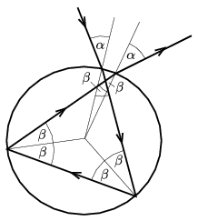

**Megoldás.**
 A fénysugár eltérülése az egyenes iránytól összesen $\tfrac{3}{2}\pi$ radián, vagyis $270^\circ$ (lásd az ábrát ):

 $2(\alpha-\beta)+2(180^\circ-2\beta)=270^\circ.$
 Innen $\alpha=3\beta-45^\circ$ következik. Másrészt (a törési törvény értelmében) fennáll, hogy
 $\sin\alpha=\frac43\sin\beta,$
 vagyis
 $\sin(3\beta-45^\circ)=\frac43\sin\beta.$
 Ennek az egyenletnek – a feladat szempontjából elfogadható – numerikus megoldása $\beta=27{,}8^\circ$, és ennek megfelelően a beesési szög: $\alpha= 38{,}5^\circ$.

