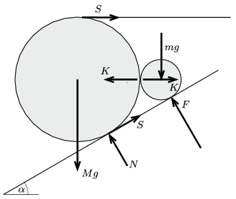

**Megoldás.**
 A megadott sugárarányok esetén a hengerek tengelyére illeszkedő sík
 $\varphi=\arcsin\frac{R-r}{R+r}=\arcsin\frac{1}{2}=30^\circ$
 nagyságú szöget zár be a lejtő síkjával, tehát a hengerek tengelye azonos magasságban helyezkedik el. A hengerekre az ábrán látható erők hatnak:

 Itt már kihasználtuk, hogy a két henger között nincs súrlódás, tehát a közöttük fellépő erő vízszintes. Az $M$ tömegű hengerre ható eredő forgatónyomaték nulla, emiatt a fonálban ébredő erő megegyezik az $S$ súrlódási erővel. Az $m$ tömegű hengerre sem hat forgatónyomaték, ami csak úgy lehetséges, ha a lejtő és ezen henger között nem lép fel súrlódási erő.
 Az erők egyensúlyának feltétele:
 $F\,\frac{\sqrt{3}}{2}=mg,$
 $\frac{1}{2}F=K,$
 $Mg=\frac{1}{2}S+\frac{\sqrt{3}}{2}N,$
 $K+\frac{1}{2}N=\left(1+ \frac{\sqrt{3}}{2} \right)S.$
 Ennek az egyenletrendszernek a megoldása:
 $F=\frac{2}{\sqrt{3}}mg,$
 $K=\frac{1}{\sqrt{3}}mg,$
 $S=\frac{(M+m)g}{2+\sqrt{3}},$
 $N=(M+m)g-\frac{2}{\sqrt{3}}mg.$
 Az $M$ tömegű henger akkor nem emelkedik fel a lejtőről, ha $N\ge 0$, vagyis ha
 $M\ge \left(\frac{2}{\sqrt{3}}-1\right)m\approx 0{,}15\,m.$
 A megadott $M=3m$ esetén ez teljesül. Az $M$ tömegű henger akkor nem csúszik meg a lejtőn, ha ($M=3m$ tömegarány mellett) a súrlódási együttható
 $\mu \ge \frac{S}{N} \approx 0{,}38.$

