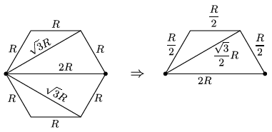

**Megoldás.**
 Az egyes vezetékek ellenállása a hosszukkal arányos. A kérdezett két ponton átmenő egyenesre szimmetrikus pontok ekvipotenciálisak, ezek összeköthetők.

 A sorosan, illetve párhuzamosan kapcsolt ellenállások eredője a kérdéses pontok között
 $R_\text{eredő}=\frac{86-32\sqrt{3}}{47}R\approx0{,}65~R.$

