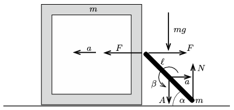
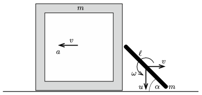

**I. megoldás.**
 Vegyük fel az egyes testekre ható erőket és a testek gyorsulását (szöggyorsulását) az 1. ábrán látható módon. Itt már kihasználtuk, hogy a tömegközépponti tétel értelmében a doboz és pálca tömegközéppontjának vízszintes gyorsulása egyenlő nagyságú, de ellentétes irányú.

 1. ábra

 A mozgásegyenletek:
 $(1)$ $F=ma,$
 $(2)$ $mg-N=mA,$
 $(3)$ $N\frac{\ell}{2\sqrt2}-F\frac{\ell}{2\sqrt2}=\frac{m\ell^2}{12}\beta.$
 Ezekhez a mozgásegyenletekhez két kényszerfeltétel (a pálca felső végének vízszintes irányú gyorsulására és az alsó végének függőleges irányú gyorsulására vonatkozó megszorítás) járul:
 $(4)$ $a-\frac{\ell}{2}\beta \frac{1}{\sqrt2}=-a,$
 $(5)$ $\frac{\ell}{2}\beta \frac{1}{\sqrt2}=A.$
 Az (1)-(5) egyenletből az öt ismeretlen ($F$, $N$, $a$, $A$ és $\beta$) meghatározható, és a doboz keresett gyorsulására az
 $a=\frac{3}{13}g$
 eredmény adódik.

**II. megoldás.**
 Számítsuk ki az energiamegmaradás törvényének felhasználásával, hogy mekkora sebességre gyorsul fel a doboz az indítást követő nagyon rövid $t$ idő alatt. Ha a testek sebessége (szögsebessége) a 2. ábrán látható nagyságú, akkor az energiatétel szerint
 $(6)$ $\frac{1}{2}mv^2+\frac{1}{2}m\left(v^2+u^2\right)+\frac{1}{2}\, \frac{m\ell^2}{12}\omega^2=mgh,$
 ahol $h$ a pálca tömegközéppontjának lesüllyedése $t$ idő alatt.

 2. ábra

 A kényszerfeltételek (miszerint a pálca végpontjai nem távolodnak el a doboztól, illetve a talajtól):
 $(7)$ $\frac{\ell}{2}\omega \frac{1}{\sqrt2}-v=v,$
 $(8)$ $\frac{\ell}{2}\omega \frac{1}{\sqrt2}-u=0.$
 A (6)-(8) egyenletből ($\beta$ kiküszöbölése után)
 $(9)$ $\frac{26}{3}v^2=2gh\qquad \text{és} \qquad u=2v$
 adódik.
 Az indulást követő nagyon rövid idő alatt a doboz mozgása $a$ gyorsulású egyenletesen változó mozgásnak tekinthető, és így a
 $v=at,\qquad \text{valamint} \qquad h=\frac{1}{2}ut=vt=at^2$
 összefüggések teljesülnek. Ezeket (9)-be helyettesítve a
 $\frac{26}{3}a^2t^2=2g\cdot at^2,$
 vagyis az
 $a=\frac{3}{13}g$
 végeredményt kapjuk.

 Megjegyzés. Az energiamegmaradásra hivatkozó megoldás azért kényelmes, mert nincs szükség a belső erők ($N$ és $F$) felvételére, hiszen ezek munkavégzése nulla.

