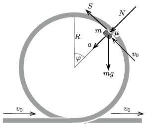
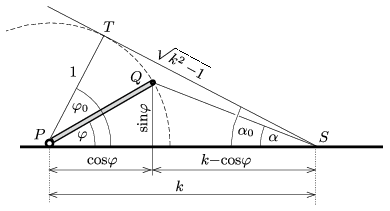

**Megoldás.**
 Jelöljük az $m$ tömegű kocsi (állandó) sebességét $v_0$-lal, a sínek által kifejtett, sugárirányú nyomóerőt $N$-nel, az érintő irányú súrlódási erőt $S$-sel, és a kocsi pillanatnyi helyzetét adjuk meg az 1. ábrán látható $\varphi$ szöggel. Legyen a kocsi tömege $m$, a rá ható nehézségi erő tehát $mg$.

 1. ábra

 A kocsi egyenletes körmozgást végez, a gyorsulása tehát a pálya középpontja felé mutató,
 $a=\frac{v_0^2}{R}$
 nagyságú vektor. A Newton-féle mozgásegyenletek:
 $mg\sin\varphi-S=0,$
 $mg\cos\varphi+N=m\frac{v_0^2}{R},$
 ahonnan
 $(1)$ $S=mg\sin\varphi,$
 $(2)$ $N=m\frac{v_0^2}{R}-mg\cos\varphi.$
 A kocsi akkor nem csúszik meg a sínen, ha a pálya minden pontjában (vagyis minden $\varphi$ szögnél) teljesül, hogy
 $(3)$ $\mu>\frac{\vert S\vert}{N}\equiv \frac{\vert\sin\varphi\vert}{k-\cos\varphi},$
 ahol
 $k=\frac{v_0^2}{Rg}$
 a sebesség nagyságára jellemző dimenziótlan szám. Az $N$ nyomóerő legkisebb értékét a pálya legmagasabb pontjában, $\varphi=0$-nál éri el. Nyilván még itt is teljesülnie kell az $N>0$ feltételnek (ellenkező esetben a kocsi elválik a sínektől), vagyis (2) alapján
 $m\frac{v_0^2}{R}>mg, \qquad \text{azaz}\qquad k>1.$
 Ahhoz, hogy a kocsi semelyik $\varphi$ szögnél ne csússzon meg, a tapadó súrlódási együttható nagyobb kell, hogy legyen
 $(4)$ $f(\varphi)\equiv \frac{\sin\varphi}{k-\cos\varphi} $
 legnagyobb értékénél. Ha (3) éppen nem teljesülne (vagyis $v_0$ egy ,,kicsit kisebb'' lenne a kritikus értéknél, akkor a kocsi az $f(\varphi)$ függvény maximumához tartozó $\varphi_0$ szög közelében megcsúszna. Feladatunk tehát a továbbiakban a (4)-ben megadott $f(\varphi)$ függvény maximumhelyének és a maximum nagyságának meghatározása.

 Megjegyzés. Elegendő a $0\le\varphi\le 180^\circ$ tartományban vizsgálódnunk, ekkor a kocsi ,felfelé'' halad. A ,,lefelé'' mozgó kocsinál, amikor $-180^\circ\le\varphi\le 0$, a csúszásmentes mozgás feltétele ugyanaz, mint a felfelé haladó kocsinál, hiszen $S(-\varphi)=-S(\varphi)$ és $N(-\varphi)=N(\varphi)$.)

 Ennek a (matematikai) problémának többféle módon is nekikezdhetünk:

 I. (geometriai) módszer. Tekintsünk egy egységnyi hosszúságú pálcát, amelyet egy vízszintes egyenesre fektettünk. + A pálcát az egyik $(P)$ végpontja körül $\varphi$ szöggel elforgatjuk ( 2. ábra ).

 2. ábra

 Ha a vízszintes egyenesre illeszkedő, a forgásponttól $k$ távolságban található $S$ pontból szemléljük a pálca másik $(Q)$ végpontját, azt a vízszinteshez képest
 $\alpha=\arctan\frac{\sin\varphi}{k-\cos\varphi}\equiv \arctan f(\varphi)$
 szögben látjuk. Az $\alpha$ hegyesszög legnagyobb értéke $f(\varphi)$ maximális értékét is megadja:
 $(\tan\alpha)_\text{max}=f_\text{max},$
 és a maximum helyét is meghatározza:
 $f\left(\varphi_0\right)= f_\text{max}.$
 Mivel a pálca forgatása közben a $Q$ pont egy körív mentén mozog, $\alpha$ legnagyobb értékét akkor kapjuk, amikor $ST$ érinti ezt a kört, vagyis a $PTS$ háromszög derékszögű. Innen következik, hogy
 $(5)$ $\cos\varphi_0=\frac{1}{k},$
 továbbá
 $f_\text{max}=\tan\alpha_0=\frac{1}{\sqrt{k^2-1}}.$
 A hullámvasút kocsija tehát akkor tud csúszásmentesen végighaladni a függőleges síkú körpályán, ha
 $(6)$ $\mu>\frac{1}{\sqrt{k^2-1}},$
 illetve ennek megfordítása,
 $k=\frac{v_0^2}{Rg}>\sqrt{\frac{1}{\mu^2}+1}$
 teljesül.

 II. (trigonometriai) módszer. A meg nem csúszás (3) feltétele az $\varepsilon$ súrlódási határszög ($\mu=\tan\varepsilon$) bevezetésével így írható fel:
 $\frac{\sin\varepsilon}{\cos\varepsilon}>\frac{\sin\varphi}{k-\cos\varphi},$
 vagyis
 $k\sin\varepsilon >\sin\varphi\cos\varepsilon+\cos\varphi\sin\varepsilon, $
 azaz
 $(7)$ $k\sin\varepsilon>\sin(\varphi+\varepsilon).$
 Ez az egyenlőtlenség biztosan teljesül, ha
 $(8)$ $\sin\varepsilon>\frac{1}{k},$
 azaz
 $\mu=\tan\varepsilon=\frac{1}{\sqrt{\frac{1}{\sin^2\varepsilon}-1}}>\frac{1}{\sqrt{k^2-1}}. $
 Ez éppen a (6) egyenlőtlenség.
 Amennyiben (6) éppen nem teljesül (vagyis $\sin\varepsilon\approx (1/k)$), akkor $\varphi=\varphi_0\approx 90^\circ-\varepsilon$ szögnél a kocsi megcsúszik, hiszen itt válik a (7) egyenlőtlenség élessé. A megcsúszás helyét így is megadhatjuk:
 $\cos\varphi_0=\sin\varepsilon\approx \frac{1}{k},$
 összhangban a geometriai módszerrel kapott (5) összefüggéssel.

 III. (differenciálszámításos) módszer. A (4) képlettel megadott függvény szélsőértékét (maximumát) a deriváltjának eltűnéséből is meg lehet kapni:
 $f'(\varphi)=\frac{(k-\cos\varphi)\cos\varphi-\sin^2\varphi}{(k-\cos\varphi)^2} \equiv \frac{k\cos\varphi-1}{(k-\cos\varphi)^2}=0.$
 Ez akkor teljesül, ha
 $\varphi=\varphi_0\qquad \text{ahol}\qquad \cos\varphi_0=\frac{1}{k},$
 továbbá
 $f_\text{max}=f(x_0)=\frac{1}{\sqrt{k^2-1}},$
 ahogy azt már korábban is megkaptuk.
 Érdemes megvizsgálni két szélsőséges esetet. Ha $\mu\gg 1$, vagyis a tapadó súrlódás igen nagy (ezt pl. a fogaskerekes megoldás valósítja meg legjobban), akkor a kritikus helyzetben (a megcsúszás határhelyzetében) $v_0\approx \sqrt{Rg}$ és $\varphi_0\approx 0$. A vonat tehát olyan lassan mozoghat, hogy a pálya tetőpontjánál majdnem leesik, és a megcsúszás is itt, a tetőpont közelében következik be, ha a sebesség egy kicsivel alacsonyabb a szükségesnél.
 Ha viszont $\mu\ll 1$ (a pálya nagyon csúszós), akkor $v_0\gg \sqrt{Rg}$ (tehát a vonatnak igen gyorsan kell haladnia), és ha mégis megcsúszik, az $\varphi_0\approx 90^\circ$-nál, vagyis a pálya függőleges szakaszánál fog bekövetkezni.

