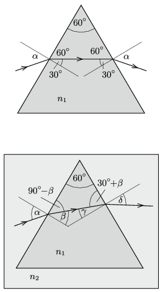

**Megoldás.**
 $a)$ A szimmetrikus pályán haladó fénysugár első törési szöge $30^\circ$, így a beesési szögre
 $\sin\alpha=n_1\sin 30^\circ=0{,}9;\qquad \alpha=64{,}16^\circ.$
 $b)$ A fénysugár eltérülése mindkét törésnél az óramutató járásának irányában: $\alpha-30^\circ$, a teljes deviáció tehát
 $\Delta_1=2(\alpha-30^\circ)=68{,}32^\circ.$
 $c)$ A prizmának a folyadékra vonatkoztatott (relatív) törésmutatója: $n=n_1/n_2=1{,}2.$ Az első határfelületnél a beesési szög a korábban kiszámított $\alpha=68{,}32^\circ$. A törési szög $\beta=\arcsin\left(\sin\alpha/n\right)=48{,}59^\circ$.

 A második határfelületnél a beesési szög: $\gamma= 60^\circ-\beta=11{,}41^\circ$, a törési szög pedig
 $\delta=\arcsin\left(n\cdot \sin\gamma\right)=13{,}73^\circ.$
 A deviáció a folyadékba merített prizma esetében:
 $\Delta_2=(\alpha-\beta)+(\delta-\gamma)=17{,}89^\circ,$
 ami $\Delta_1-\Delta_2=50{,}43^\circ$-kal kisebb eltérülést jelent, mint a levegőben levő prizmánál.

