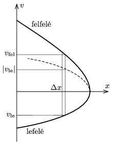
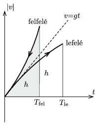

**I. megoldás.**
 Ugyanabban a magasságban a lefelé mozgó pingponglabda sebességének abszolút értéke biztosan kisebb, mint amikor – ugyanebben a magasságban – még felfelé mozgott, hiszen a gravitációs helyzeti energiája ugyanakkora, az összes mechanikai energiája pedig – a légellenállás munkája miatt – kisebb ( 1. ábra ). Kisebb sebességgel mozogva a labda egy ugyanakkora (kicsiny) útszakaszt hosszabb idő alatt tesz meg, és ez minden útszakaszra, tehát azok együttesére is igaz, emiatt a lefelé mozgás teljes ideje nagyobb , mint a felfelé mozgásé.

 1. ábra

**II. megoldás.**
 A felfelé mozgó labda gyorsulásának abszolút értéke (vagyis a lassulása) minden pillanatban nagyobb, mint a lefelé mozgó labdáé, hiszen az első esetben a nehézségi erő és a közegellenállási erő ugyanolyan irányú, a második esetben pedig ellentétes irányúak. Ábrázoljuk a sebesség nagyságát az idő függvényében úgy, hogy az origót a tetőpont elérésének pillanatához igazítjuk, de a felfelé haladó labda mozgását ,,időben visszafelé'' tüntetjük fel ( 2.  ábra ). Ekkor a nagyobb gyorsulású mozgásnál (a felfelé emelkedésnél) a $v_\text{fel}$ sebesség gyorsabban növekszik, mint a lefelé haladó labda $v_\text{le}$ sebessége. Mindkét sebesség a tetőpontnál nulla, tehát minden ,,pillanatban'' (ténylegesen a tetőpont eléréséhez viszonyítva ugyanakkora időkülönbségű pillanatokban) $v_\text{fel}$ nagyobb, mint $v_\text{le}$, így ugyanazt az utat rövidebb idő alatt teszi meg a labda felfelé mozogva, mint lefelé.

 2. ábra

