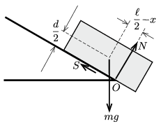
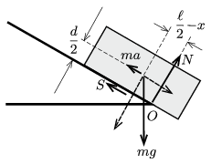

**I. megoldás.**
 A testre ható erők: $mg$ nehézségi erő, a lejtő $N$ nyomóereje, ami határesetben a lejtő alsó élénél, az $O$ pontnál hat, valamint az $S$ súrlódási erő ( 1. ábra ). A hasáb a lejtőre merőlegesen nem gyorsul, így
 $N=mg\cos\alpha.$
 A súrlódási erő (mivel a hasáb csúszik):
 $S=\mu N=\mu mg \cos\alpha.$
 A test gyorsulása (a lejtő irányú eredő erőből számolva):
 $a=\frac{mg\sin\alpha-S}{m}=g(\sin\alpha-\mu \cos\alpha).$
 (A $\mu$-re megadott egyenlőtlenség miatt $a>0$.)

 1. ábra
 A hasáb mindaddig nem billen meg, amíg a rá ható erők forgatónyomatéka a tömegközéppontjára vonatkoztatva nulla. Határesetben (amikor az $N$ erő erőkarja a lehető legnagyobb):
 $S\frac{d}{2}-N\left(\frac{\ell}{2}-x\right)=0,$
 vagyis
 $\frac{d}{2}\, mg\mu \cos\alpha=\left(\frac{\ell}{2}-x\right)\,mg\cos\alpha.$
 Innen a hasáb legnagyobb túlnyúlása az asztal peremén (a lejtő esésvonala mentén mérve):
 $x=\frac{\ell-\mu d}{2}.$
 Érdekes, hogy ez az eredmény nem függ a lejtő hajlásszögétől.
 Amennyiben a súrlódás elhanyagolható, vagyis $\mu=0$, a legnagyobb túlnyúlás: $x=\frac{\ell}{2}$.

 Megjegyzés. Ha a külső erők forgatónyomatékát nem a tömegközéppontra, hanem – mondjuk – a hasáb és a lejtő legalsó érintkezési pontjára írjuk fel, és ennek az eredő forgatónyomatéknak az eltűnését követeljük meg, hibás eredményt kapunk! Egyensúlyi állapotban a nyugvó testre ható erők forgatónyomatéka bármely pontra vonatkoztatva nulla, de a gyorsulva mozgó merev testekre ez általában már nem igaz. Helyes eredményt csak a tömegközéppontra és még néhány speciális helyzetű pontra felírt forgatónyomaték-egyensúlyi egyenletekből kapunk. Elterjedt tévhit, hogy a pillanatnyi forgástengely pontjai is ilyen speciális pontok, ez azonban általában nem igaz .

**II. megoldás.**
 A forgási egyensúly problémáját visszavezethetjük egy statikai feladatra, ha ,,beleülünk'' a téglatesttel együtt gyorsuló mozgást végző vonatkoztatási rendszerbe. Innen nézve a test (minden szempontból) egyensúlyban van, tehát a rá ható erők eredő forgatónyomatéka bármely pontra, így a lejtő és a lejtő alsó élénél lévő $O$ pontra nézve is nulla. Nem szabad megfeledkeznünk arról, hogy ebben a gyorsuló koordináta-rendszerben fellép egy – a test tömegközéppontjában ható – $ma$ nagyságú, a gyorsulással ellentétes irányú ún. tehetetlenségi erő is ( 2. ábra ).

 2. ábra
 Az $O$ pontra az $N$ és az $S$ erőnek nincs forgatónyomatéka, hanem csak a nehézségi erőnek és a tehetetlenségi erőnek. Ezek lejtő irányú komponense
 $mg\sin\alpha-ma=mg\sin\alpha-mg(\sin\alpha-\mu \cos\alpha)=\mu mg \cos\alpha,$
 $d/2$ nagyságú erőkarral, a lejtőre merőleges erőkomponens pedig $mg\cos\alpha$, az erőkar pedig $(\ell/2-x).$ A forgatónyomatékok egyensúlyi egyenlete:
 $\frac{d}{2}\,\mu mg \cos\alpha=\left(\frac{\ell}{2}-x\right)\,mg\cos\alpha,$
 ahonnan
 $x=\frac{\ell-\mu d}{2}.$

