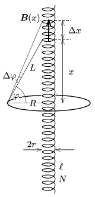

**I. megoldás.**
 Jelöljük a körvezető adatait 1-es, a szolenoidét pedig 2-es indexszel. Ha a körvezetőben egy adott pillanatban $I_1(t)$ erősségű áram folyik, annak mágneses tere a szolenoidban $\Phi_2(t)=I_1(t)\,L_{1,2}$ mágneses fluxust hoz létre, ahol $L_{1,2}$ a két vezető kölcsönös indukciós együtthatója. (A kölcsönös indukciós együttható a vezetékek alakjától és térbeli elhelyezkedésüktől függő, de időben állandó mennyiség.) Ha sikerül meghatározni ezt az együtthatót, akkor a voltmérő által mutatott feszültség nagysága már könnyen megkapható:
 $U_2=\frac{\Delta \Phi_2}{\Delta t}= \frac{\Delta I_1}{\Delta t}L_{1,2}=\alpha\cdot L_{1,2}.$
 A kölcsönös indukciós együttható érdekes tulajdonsága, hogy a szerepek felcserélésére nézve szimmetrikus:
 $L_{1,2}=L_{2,1},$
 vagyis a körvezető egységnyi erősségű árama ugyanakkora mágneses fluxust hoz létre a szolenoidban, mint amekkora fluxust eredményez a szolenoidban folyó egységnyi erősségű áram a körvezetőben. Ez utóbbi elrendezést könnyebb kiszámítani, hiszen ha a szolenoidban $I_2$ áram folyik, az a szolenoid belsejében homogénnek tekinthető,
 $B=\mu_0\frac{I_2N}{\ell}=\mu_0 n\cdot I_2$
 indukciójú mágneses teret, vagyis
 $\Phi_2=B\,r^2\pi=\mu_0 nr^2\pi\cdot I_2 $
 mágneses fluxust eredményez. Ez a fluxus teljes egészében áthalad az $R$ sugarú körvezetőn, és mivel $\ell\gg R$ esetén a szórt mágneses tér kicsi (az erővonalak jó közelítéssel a körvezetőn kívül jutnak vissza a szolenoid egyik végétől a másikig), $\Phi_2=\Phi_1$, a keresett kölcsönös indukciós együttható:
 $L_{1,2}=L_{2,1}=\mu_0 nr^2\pi,$
 vagyis az ideális voltmérő által mutatott feszültség:
 $U=\mu_0 nr^2\pi\alpha.$
 (Érdekes, hogy $U$ nem függ a körvezető $R$ sugarától.)

**II. megoldás.**
 Az indukált feszültség közvetlen módon, a szoleniod meneteiben indukálódó feszültségek összegzésével is kiszámítható. Ismert (lásd pl. a ,,Négyjegyű függvénytáblázatok'' 153. old., vagy a Biot–Savart-törvényt), hogy egy $R$ sugarú körvezető mágneses mezőjének indukcióvektora a kör tengelyében a középponttól $x$ távolságban
 $B(x)=\frac{\mu_0}{2} \,\frac{R^2}{(R^2+x^2)^{3/2}}I,$

 amit az ábra jelöléseit használva
 $B(\varphi)=\frac{\mu_0}{2R} \,{\cos^3\varphi}I(t)$
 alakban is felírhatunk. Tekintsük most a vékony ($r\ll R$ sugarú) szolenoidnak azt a darabját, amit a körvezető valamely pontjából $\varphi$ és $\varphi+\Delta\varphi$ szögek között látunk. Ennek a szolenoiddarabnak
 $\Delta x\approx \frac{L\Delta\varphi}{\cos\varphi}=\frac{R\Delta\varphi}{\cos^2\varphi}$
 a hossza, és benne $n\Delta x$ számú, $r^2\pi$ keresztmetszetű menet található. A teljes szolenoidban indukálódó feszültség $I(t)=\alpha t$ módon változó áramerősség esetén
 $U=\frac{\Delta\Phi}{\Delta t}= \mu_0 r^2\pi n\alpha \sum \frac{\cos\varphi}{2} \cdot \Delta\varphi.$
 Az összegzés során (mivel a szolenoid ,,igen hosszú'') a $\varphi$ szög $-\frac{\pi}{2}$-től $+\frac{\pi}{2}$-ig változik, és ekkor a fenti képletben szereplő összeg számértéke 1. Ezt pl. integrálszámítással láthatjuk be:
 $\sum \frac{\cos\varphi}{2} \cdot \Delta\varphi\approx \int\limits_{-\pi/2}^{+\pi/2}\frac{\cos\varphi}{2}\,{\rm d}\varphi=1.$

 Megjegyzés. Ugyanezt az eredményt elemi úton, egy mechanikai analógia segítségével is megkaphatjuk. Ha egy $m$ tömegű, pontszerű testet egy $R$ sugarú, függőleges síkú körvonal mentén mozgatunk a kör legmélyebb pontjától a legmagasabb pontjáig, akkor a test helyzeti energiájának megváltozása:
 $\Delta E_\text{helyzeti}=mg\cdot 2R,$
 és ugyanennyi a test emelése során végzett munka:
 $W=\sum F_\text{érintőleges}\,\Delta s=\sum mg\cos\varphi\cdot R\Delta \varphi=mg\cdot 2R.$
 ($\varphi$ a test helyzetét jellemző, a vízszintestől mért szög.) Innen $2mgR$-rel való egyszerűsítés után kapjuk, hogy
 $\sum \frac{\cos\varphi}{2} \cdot \Delta\varphi\approx 1,$
 és a közelítés annál pontosabb, minél kisebb részekre osztjuk fel a körvonalat.

**III. megoldás.**
 Legyen az $I(t)$ erősségű árammal átjárt körvezető által létrehozott mágneses indukciónak tengely irányú komponense a szolenoid belsejében ${B}(x)$ (aminek konkrét alakját nem szükséges ismernünk). A szolenoid $\Delta x$ hosszúságú darabján $n\Delta x$ számú, egyenként $r^2\pi$ területű menet van, az ezeken áthaladó mágneses fluxus tehát $\Delta \Phi=B(x)nr^2\pi\Delta x$. A szolenoid teljes fluxusa:
 $\Phi=\sum \Delta \Phi=nr^2\pi\cdot\sum B(x)\Delta x.$
 A $\sum B(x)\Delta x$ összeg (amely a szolenoid egészére terjed ki) kiegészíthető egy ,,visszafelé futó'', a körvezetőn kívül, attól távol záródó görbe menti összeggel, hiszen nagy távolságban a körvezető mágneses tere elhanyagolható. A zárt görbére számított ,,mágneses körfeszültség'' az Ampere-féle gerjesztési törvény szerint $\mu_0\cdot I(t)$-vel egyenlő, így a teljes fluxus változási sebessége, vagyis az indukált feszültség:
 $U=\frac{\Delta\Phi}{\Delta t}= \mu_0 r^2\pi n\frac{\Delta I(t)}{\Delta t}= \mu_0 r^2\pi n\alpha.$

