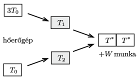
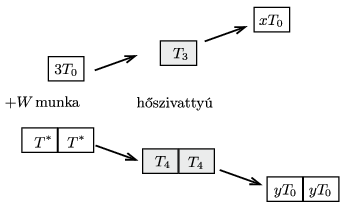
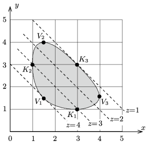

**I. megoldás.**
 Jelöljük a hidegebb test kezdeti 100 K-es hőmérsékletét $T_0$-lal, a másik két test hőmérséklete ekkor $3T_0$. Működtessünk az egyik melegebb test és a hidegebb test segítségével egy ideális Carnot-féle hőerőgépet. Legyen a két test (lassan változó) hőmérséklete $T_1$ és $T_2$, a hőmérséklet kicsiny megváltozása pedig $\Delta T_1<0$ és $\Delta T_2>0$. A leadott és a felvett hő a hőkapacitások egyenlősége miatt a hőmérséklet-változással arányos. Ideális esetben (a legnagyobb elérhető hatásfoknál)
 $\frac{\Delta T_1}{T_1}+\frac{\Delta T_2}{T_2}=\frac{\Delta (T_1T_2)}{T_1T_2}=0,$
 vagyis $\Delta (T_1T_2)=0$, azaz
 $T_1T_2=\text{állandó}=3T_0^2.$
 A hőerőgép működése addig tart, amíg el nem érjük a $T_1=T_2=T^*=\sqrt{3}\,T_0$ hőmérsékleti egyensúlyi állapotot ( 1. ábra ). A gép a működése során
 $W=C(T_0+3T_0)-2C\,\sqrt{3}\,T_0=(4-2\sqrt{3})CT_0$
 nagyságú hasznosítható munkát végez, amit (pl. elektromos formában, akkumulátorok feltöltésével) tárolhatunk. ($C$ a testek egymással megegyező hőkapacitását jelöli.)

 1. ábra
 Használjuk fel a $W$ munkát arra, hogy a másik melegebb (kezdetben $3T_0$ hőmérsékletű) testet a két hidegebb (kezdetben $\sqrt{3}T_0$ hőmérsékletű) test lehűlésével kísérve valamennyire felmelegítjük. Ezt legnagyobb hatásfokkal egy fordított Carnot-gépként működő hőszivattyú segítségével tehetjük meg ( 2. ábra ). A testek hőmérsékletét $T_3$-mal és $T_4$-gyel jelölve felírhatjuk, hogy
 $\frac{Q_3}{T_3}+\frac{Q_4}{T_4}=0,\qquad \text{azaz}\qquad \frac{\Delta T_3}{T_3}+2\frac{\Delta T_4}{T_4}=\frac{\Delta\left(T_3T_4^2\right)}{T_3T_4^2}=0.$
 (A 2-es szorzótényező azt fejezi ki, hogy a hidegebb test tömege 2-szerese a melegebbének.) Ezek szerint a hőszivattyú kezdeti állapotát is figyelembe véve
 $T_3T_4^2=\text{állandó}=9T_0^3.$
 A hőszivattyú működése addig tart, amíg fel nem használjuk a hőerőgép által termelt $W$ munkát.

 2. ábra
 Jelöljük a legmelegebb test végső hőmérsékletét $xT_0$-lal, a két hidegebb test végső hőmérsékletét pedig $yT_0$-lal! A fenti összefüggések szerint
 $(1)$ $xy^2=9.$
 Hőszivattyú esetén a munka
 $W=C(xT_0-3T_0)-2C(\sqrt(3)T_0-yT_0)=CT_0(x-3-2\sqrt{3}+2y),$
 ami akkor egyezik meg a hőerőgépből nyert munkával, ha fennáll:
 $(2)$ $x+2y=7.$
 A feladat eredeti kérdése: elérhető-e a 400 K-es csúcshőmérséklet, vagyis megoldása-e az (1) és (2) egyenletrendszernek $x=4$? Behelyettesítéssel igazolható, hogy igen, és a hozzá tartozó $y$ értéke 1,5, vagyis a másik két test hőmérséklete ebben az állapotban 150 K lesz.

 Megjegyzés. Felmerül a kérdés: Vajon elérhető-e a leírt módon 400 K-nél magasabb hőmérséklet? A válasz: Nem! Az egyik test legmelegebb állapotában a másik két test hőmérséklete ugyanakkora kell legyen; ellenkező esetben azokkal egy hőerőgépet működtetve további hasznos munkát lehetne ,,nyerni''. Két egyforma és egy tőlük különböző hőmérsékletű testekre fennáll az (1) és (2) egyenletrendszer. Ennek az ($y$ kiküszöbölése után $x$-re nézve
 $x^3-14x^2+49 x-36=0$
 harmadfokú) egyenletnek nyilvánvaló megoldása $x=1$, ami a kezdeti állapotnak felel meg. Az $x-1$ gyöktényezővel osztva egy másodfokú egyenletet kapunk, amelynek egyik gyöke a feladat szempontjából érdekes $x=4$, a másik pedig $x=9$. Ez utóbbihoz $y=-1$ tartozik, ami nem ír le fizikailag értelmes megoldást.
 Az adott kezdeti feltételek mellett tehát valóban 400 K a legmagasabb elérhető hőmérséklet, és az is csak ideális körülmények között (ideális Carnot-gépek és 100%-os energiatárolási hatásfok) esetén lenne létrehozható.

**II. megoldás.**
 A testek azonos, állandó hőkapacitását $C$-vel jelölve egy-egy test belső energiája
 $U=CT.$
 Mivel a három testből álló rendszer energetikailag zárt, ezért az összenergia állandó:
 $U_1+U_2+U_3=C\left(T_1+T_2+T_3\right)=\text{állandó},$
 vagyis az abszolút hőmérsékletek összege sem változhat.
 Másrészt a hőerőgép és a hűtőgép (reverzibilis) működése közben nem változhat a hőtartályok entrópiájának összege:
 $S_1+S_2+S_3 =\text{állandó.}$
 Egy-egy test entrópiája így számítható ki:
 $S=\int \frac{{\rm d}Q}{T}=\int \frac{{C\rm d}T}{T}=C\int \frac{{\rm d}T}{T}=C\ln T+\text{állandó}.$
 Nem változhat tehát a következő összeg sem:
 $C\ln T_1+C\ln T_2+C\ln T_3= C\ln \left(T_1T_2T_3\right).$
 Ez csak úgy lehet, ha az abszolút hőmérsékletek szorzata is állandó marad.
 Feladatunkban $T_1=T_2=300~\rm K$, $T_3=100~\rm K$. Olyan új $T_1'$, $T_2'$ és $T_3'$ hőmérsékletek érhetők el tehát, amelyekre
 $T_1'+T_2'+T_3'=700~{\rm K}\qquad \text{és}\qquad T_1' T_2' T_3'= 9\cdot10^6~{\rm K}^3.$
 Áttekinthetőbb lesz a számolás, ha 100 K-es egységekben, vagyis
 $T_1=x\cdot 100~{\rm K},\quad T_2=y\cdot 100~{\rm K},\quad T_3=z\cdot 100~{\rm K}$
 alakban keressük a megoldást. Ezzel az
 $x+y+z=7 \quad \text{és}\quad xyz=9$
 egyenletrendszerhez jutunk. Arra vagyunk kiváncsiak, lehetséges-e $z=4$ mellett két egyenlő, pozitív gyöke ennek az egyenletrendszernek. Jelöljük ezt a gyököt $x$-szel, ekkor
 $x+x+4=7 \quad \text{és}\quad x\cdot x\cdot 4=9$
 lehetséges (pozitív) megoldását keressük, amely pedig $x=1{,}5.$
 Az új hőmérsékletek tehát 150 K, 150 K és 400 K.
 Megjegyzés. A testek azonos, állandó (a hőmérsékletüktől nem függő) hőkapacitását $C$-vel jelölve egy-egy test belső energiája
 $U=CT.$
 Mivel a három testből álló rendszer energetikailag zárt, ezért az összenergia állandó:
 $U_1+U_2+U_3=C\left(T_1+T_2+T_3\right)=\text{állandó},$
 vagyis az abszolút hőmérsékletek összege nsem változhat.
 Másrészt a hőerőgép és a hűtőgép működése közben nem csökkenhet a rendszer entrópiája (a három test entrópiájának összege), reverzibilis folyamatok során pedig az entrópia változatlan marad:
 $S_1+S_2+S_3 =\text{állandó, vagy növekszik}.$
 Egy-egy test entrópiája így számítható ki:
 $S=\int \frac{{\rm d}Q}{T}=\int \frac{{C\rm d}T}{T}=C\int \frac{{\rm d}T}{T}=C\ln T+\text{állandó}.$
 Nem csökkenhet (reverzibilis folyamatban nem változhat) tehát a
 $C\ln T_1+C\ln T_2+C\ln T_3= C\ln \left(T_1T_2T_3\right)$
 összeg, ami csak úgy lehetséges, ha az abszolút hőmérsékletek szorzata nem csökken.
 Feladatunkban $T_1=T_2=300~\rm K$, $T_3=100~\rm K$. Olyan új $T_1'$, $T_2'$ és $T_3'$ hőmérsékletek érhetők el tehát, amelyekre
 $T_1'+T_2'+T_3'=700~{\rm K}\qquad \text{és}\qquad T_1' T_2' T_3'\ge 9\cdot10^6~{\rm K}^3.$
 Áttekinthetőbb lesz a számolás, ha 100 K-es egységekben, vagyis
 $T_1=x\cdot 100~{\rm K},\quad T_2=x\cdot 100~{\rm K},\quad T_1=z\cdot 100~{\rm K}$
 alakban keressük a megoldást. Ezzel az
 $x+y+z=7, \qquad xyz\ge9$
 feltételekhez, vagy – mondjuk – $z$ kiküszöbölése után a
 $(3)$ $(7-x-y)xy\ge 9$
 egyenlőtlenséghez jutunk. Fennáll még, hogy $x$, $y$ és $z$ mindegyike pozitív szám, vagyis
 $(4).$ $x>0, \quad y>0\quad \text{és} \quad x+y<7.$
 Ábrázoljuk (például a www.wolframalpha.com program segítségével) a (3) és (4) egyenlőtlenségnek megfelelő értékeket az $x-y$ koordináta-rendszerben! Így a 3. ábrán sötétebben jelölt tartományt kapjuk, amelynek határvonala a reverzibilis állapotváltozásnak felel meg. A kezdeti állapot a változók háromféle lehetséges szereposztásának megfelelően a $K_1$, $K_2$ és $K_3$ pontok valamelyike, a végállapot pedig (amelyben valamelyik test hőmérséklete maximális) a $V_1$, $V_2$ és $V_3$ pontok egyike. A 3. ábráról leolvasható, hogy bármelyik test legmagasabb hőmérséklete 400 K lehet, és ilyenkor a másik két test 150 K-es. (Az is kiderül az ábráról, hogy egy-egy test legalacsonyabb hőmérséklete 100 K lehet, és ebben az állapotban a másik két test 300 K-es, ahogy ez a kezdeti állapotban volt.)

 3. ábra
 A rendszer – megfelelő hűtőgép és hőerőgép folyamatos működtetésével – úgy juthat el valamelyik $K_i$ kezdőállapotból az egyik $V_j$ végállapotba, hogy közben az összentrópia állandó marad, vagyis a rendszer az $x-y$ síkon a sötét terület határvonala mentén ,,mozog''. Ha valahol bejutna a rendszer a sötét tartomány belsejébe (vagyis az entrópia növekedésével járó irreverzibilis folyamat is végbemenne), akkor már biztosan nem kerülhetne vissza vissza az alacsonyabb entrópiájú határgörbére, vagyis nem érhetné el a kívánt 400 K-es állapotot.

