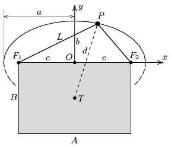

**Megoldás.**
 Jelöljük a fonál hosszát $L$-lel, és legyen a fonál két vége a kép egyik, $A$ hosszúságú oldalának $F_1$ és $F_2$ végpontjához rögzítve.

 Adjuk meg a képtartó szög (az ábrán a $P$ pont) helyét az $F_1$ és $F_2$ pontok $O$ felezőpontján átmenő, a téglalap oldalaival párhuzamos tengelyű $(x,y)$ derékszögű koordináta-rendszerben! A fonál hosszának állandóságából következik, hogy a $P$ pont rajta fekszik az $F_1$ és $F_2$ fókuszpontú,
 $a=\frac{L}{2}, \qquad b=\frac{\sqrt{L^2-A^2}}{2} $
 féltengelyű ellipszisen . Az ellipszis egyenlete:
 $\frac{x^2}{a^2}+\frac{y^2}{b^2}=1,$
 vagyis
 $y=b\sqrt{1-\frac{x^2}{a^2}},$
 ami a kép méreteivel és a fonál hosszával kifejezve így írható:
 $y=\frac{\sqrt{L^2-A^2}}{2}\sqrt{1-\frac{4x^2}{L^2}}.$
 A szögre akasztott kép egyensúlyi helyzetben úgy helyezkedik el, hogy a $P$-re és $T$-re illeszkedő egyenes függőleges legyen. A kép helyzeti energiája a $d=PT$ hossznak $(-1)$-szeresével arányos. Ha a szimmetrikus helyzetben (vagyis $(x=0$-nál) a $d(x)$ függvénynek (és ezzel együtt $d^2(x)$-nek is) lokális maximuma van, akkor ez a helyzet stabil , ha viszont minimuma van, akkor az egyensúly labilis , a kép a legkisebb külső zavar hatására valamelyik oldalra kibillen.
 Vizsgáljuk meg $\left[d(x)\right]^2$ viselkedését a szimmetrikus helyzethez közeli (vagyis $x\ll A$-val jellemzett) tartományban:
 $\left[d(x)\right]^2=x^2+\left(y+\frac{B}{2}\right)^2=x^2+\left(b\sqrt{1-\frac{x^2}{a^2}}+\frac{B}{2}\right)^2.$
 Alkalmazva az $\varepsilon\ll 1$ esetén érvényes
 $\sqrt{1+\varepsilon}\approx 1+\frac{\varepsilon}{2}$
 összefüggést, a vizsgált kifejezés közelítőleg így írható:
 $\left[d(x)\right]^2\approx x^2+\left(b -b\frac{x^2}{2a^2}+\frac{B}{2}\right)^2\approx \left(b+\frac{B}{2}\right)^2+
x^2 \left[1- \left(b+\frac{B}{2}\right)\frac{b}{a^2} \right].$
 A stabilitást a szögletes zárójelben álló kifejezés előjele dönti el. A kép helyzete stabil, ha
 $1- \left(\frac{\sqrt{L^2-A^2}}{2} +\frac{B}{2}\right)\frac{2\sqrt{L^2-A^2}}{L^2} <0,$
 vagyis
 $1<\frac{L^2-A^2}{L^2}+B\frac{\sqrt{L^2-A^2}}{L^2},$
 $A^2<B\sqrt{L^2-A^2},$
 tehát
 $L>\frac{A}{B}\sqrt{A^2+B^2}.$
 Hasonlóan egyszerű a számolás, ha $d^2$-et $y$-nal fejezzük ki:
 $\left[d(y)\right]^2=a^2-a^2\frac{y^2}{b^2}+\left(y+\frac{B}{2}\right)^2,$
 de a $0<y<b$ feltételnek is teljesülnie kell. Ennek a másodfokú függvénynek $y^*=\frac{b^2B}{2(a^2-b^2)}$-nél van maximuma (parabolacsúcs). Ha ez az az érték $b$-nél kisebb, akkor ott van $d^2$ maximuma, és a kép ferdén áll. Ha $y^*\ge b$, akkor a tényleges maximum $y=b$-nél van, és a kép egyenesen áll. A
 $\frac{b^2B}{2(a^2-b^2)}\ge b$
 feltétel $A$-val és $B$-vel kifejezve:
 $L>\frac{A}{B}\sqrt{A^2+B^2}.$

