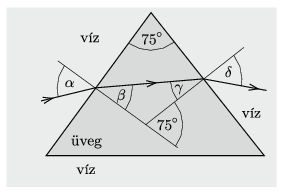

**Megoldás.**
 $a)$Az üvegnek a vízre vonatkoztatott (relatív) törésmutatója
 $n=\frac{n_\text{üveg}}{n_\text{víz}}=\frac{3}{2}\cdot \frac{3}{4} =\frac{9}{8}=1{,}125.$
 A vízben a fény terjedési sebessége $n$-szer akkora, mint az üvegben, a frekvencia pedig nem változik, így
 $\frac{v_\text{víz}}{v_\text{üveg}}=\frac{\lambda_\text{víz}}{\lambda_\text{üveg}}=1{,}125.$
 Az üvegből a vízbe kilépő fény hullámhossza tehát 12,5%-kal megnő.
 $b)$ Legyen az ábrán látható módon az első fénytörésnél a beesési szög $\alpha$, a törési szög $\beta$, a második határfelületnél a beesési szög $\gamma$, a törési szög pedig $\delta$.

 A Snellius–Descartes-törvény és geometriai összefüggések szerint fennáll, hogy
 $(1)$ $\frac{\sin\alpha}{\sin\beta}=\frac{9}{8},$
 $(2)$ $\beta+\gamma=75^\circ,$
 $(3)$ $\frac{\sin\delta}{\sin\gamma}=\frac{9}{8},$
 és a fénysugár eltérülési szöge (az ún. deviáció)
 $(4)$ $\Delta=(\alpha-\beta)+(\delta-\gamma).$
 Esetünkben $\alpha=45^\circ$, és ebből az (1)-(4) összefüggéseket alkalmazva lépésenként számolható, hogy
 $\beta=38{,}9^\circ, \qquad \gamma=36{,}1^\circ, \qquad \delta=41{,}5^\circ, \qquad \Delta=11{,}5^\circ.$
 $c)$ Alkalmazzuk a (3), (2) majd az (1) összefüggést! A fény nem lép ki az üvegből, ha $\sin\gamma>\frac89$ vagyis $\gamma>62{,}7^\circ$ (ekkor teljes visszaverődés történik). Ilyenkor $\beta<12{,}3^\circ$, és végül $\alpha<13{,}8^\circ$.

