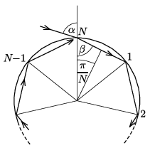

**Megoldás.**
 Tételezzük fel, hogy a fénysugár a vízcseppben szabályos $N$-szög mentén halad körbe. (Természetesen minden visszaverődési pontnál a fény egy része megtörve kilép a vízcseppből.) Az ábrán látható jelölésekkel a törési törvény szerint
 $\sin\alpha=\frac{4}{3}\sin\beta.$

 Másrészt igaz, hogy $\beta=\frac{\pi}{2}-\frac{\pi}{N},$ tehát a törési törvény így írható:
 $\sin\alpha=\frac{4}{3}\cos\frac{180^\circ}{N}.$
 Nyilván teljesül, hogy
 $\sin\alpha\le 1, \qquad \text{azaz} \qquad
 \cos\frac{180^\circ}{N}\le \frac{3}{4}, \qquad \text{vagyis} \qquad \frac{180^\circ}{N}\ge 41{,}4^\circ,\quad N\le 4{,}3.$
 Ezek szerint a 2-nél nagyobb egészek közül csak $N=3$ és $N=4$-re adható fel a feladat, és ezeknél a megfelelő beesési szögek: $\alpha_3=41{,}8^\circ$ és $\alpha_4=70{,}5^\circ$.

