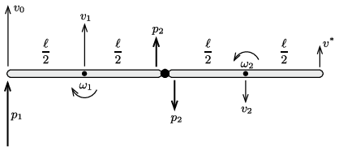

**Megoldás.**
 Jelöljük egy-egy rúd hosszát $\ell$-lel, tömegét $m$-mel; a tömegközéppontjukra vonatkozó tehetetlenségi nyomatékuk ekkor $\Theta=\tfrac{1}{12}m \ell^2.$
 Ha a bal oldali rúd bal oldali végére egy hirtelen $p_1=F\Delta t$ erőlökést fejtünk ki, a rudak haladó és forgó mozgásba jönnek, tömegközéppontjuk valamekkora $v_1$ és $v_2$ sebességgel kezd el mozogni (a rudakra merőleges irányban), a tömegközéppontjuk körül pedig $\omega_1$ és $\omega_2$ szögsebességre tesznek szert az ábrán látható irányításokkal.
 A két rúd közötti csukló is kifejt valamekkora, $p_2$ erőlökést, amelynek iránya ugyancsak merőleges a rudakra. (Ha az egymással ellentétes irányú erőlökéseknek lenne rúdirányú összetevője, akkor a rudak hirtelen egymás felé, vagy egymástól eltávolodva kezdenének el mozogni, ez pedig a csuklós kapcsolat miatt nem lehetséges.)

 Írjuk fel a rudak tömegközépponti mozgására, illetve a forgómozgásukra vonatkozó Newton-egyenleteket!
 $(1)$ $p_1+p_2=mv_1,$
 $(2)$ $p_2=mv_2,$
 $(3)$ $\left(p_1-p_2\right) \frac{\ell}{2}=\frac{1}{12}m \ell^2\,\omega_1,$
 $(4)$ $p_2 \frac{\ell}{2}=\frac{1}{12}m \ell^2\,\omega_2.$
 Tudjuk továbbá, hogy a meglökött rúdvég sebessége
 $(5)$ $v_0=v_1+ \frac{\ell}{2}\omega_1,$
 a csuklósan összekapcsolt rúdvégek sebessége pedig megegyezik:
 $(6)$ $\frac{\ell}{2}\omega_1 -v_1= v_2+\frac{\ell}{2}\omega_2.$
 A keresett sebesség (a jobb oldali rúd jobb oldali végpontjának sebessége):
 $(7)$ $v^*=\frac{\ell}{2}\omega_2-v_2.$
 Az (1)-(6) egyenletrendszer megoldása:
 $p_1=\frac{2}{7}mv_0,\qquad p_2=\frac{1}{14}mv_0,$
 $v_1=\frac{5}{14}v_0,\qquad v_2=\frac{1}{14}v_0,\qquad \omega_1=\frac{9}{7}\,\frac{v_0}{\ell},
\qquad \omega_2=\frac{3}{7}\,\frac{v_0}{\ell},$
 és végül (7)-nek megfelelően
 $v^*=\frac{v_0}7.$
 A jobb oldali rúd szabad vége tehát ,,előrefele'' (a külső erőlökéssel megegyező irányban) $\frac{1}{7}\,\frac{\rm m}{\rm s}$ kezdősebességgel kezd el mozogni.

