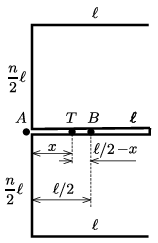

**Megoldás.**
 Az elvágás nélkül, tengelyesen szimmetrikus alakban meghajlított huzal az ábrán látható alakú.

 A függőleges szárának tömege $n\ell$-lel arányos, és a tömegközéppontja a függőleges szár középpontjában (az $A$ pontban) van. A vízszintes szárak össztömege $4\ell$-lel arányos, és a tömegközéppontjuk a középső szár mentén a függőleges szártól $\ell/2$ távol lévő $B$ pontban található. Az egész alakzat $T$ tömegközéppontja a két rész tömegközéppontja közötti $\ell/2$ távolságot a tömegek arányában osztja, tehát $T$-nek a függőleges szártól mért $x$ távolságára igaz, hogy
 $\frac{x}{(\ell/2)-x}=\frac{4\ell}{n\ell}=\frac{4}{n},$
 vagyis
 $x=\frac{2\ell}{n+4}.$

