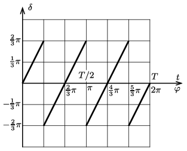

**Megoldás.**
 Jelöljük a hasáb radiánban mért elfordulási szögét $\varphi$-vel, a lézersugár eltérülési szögét pedig $\delta$-val. (A megadott időintervallumban le $0\le\varphi\le 2\pi$, továbbá $\varphi=2\pi t/T$. A $\delta$ szöget nem a szokásos 0 és $2\pi$ közötti, hanem $-\pi$ és $+\pi$ közé eső értékekkel fogjuk megadni.
 A $t = 0$ pillanatban – a feladat szövege szerint – $\varphi=0$, és nyilván $\delta=0$. A tükrözési törvény szerint a $\varphi$ szög növekedtével egy darabig $\delta=2\varphi$, de ez csak addig igaz, amíg a lézersugár a hasáb oldalélére nem esik. Ez $\varphi=\tfrac{1}{3}\pi=60^\circ$-nál, $t =T/6$ idő elteltével következik be. Ekkor a lézerfény hirtelen egy másik síktükörre esik, az eltérülés szöge $+\tfrac43\pi$-ről $-\tfrac43\pi$-re vált át. Ezután $\varphi$ növekedtével $\delta$ kétszeres ütemben növekszik, és ez egészen $\varphi=\pi$-ig tart (ekkor ér a lézerfény útjába a hasáb következő oldaléle), és ez ismétlődik a továbbiakban is. Az eltérülési szög és az elfordulás szöge, valamint az eltelt idő közötti kapcsolatot az alábbi grafikon mutatja:

 A szakadási pontokban $\delta$-nak nincs határozott értéke, mert ilyenkor a fénysugár nem síktükörre, hanem egy vékony élre esik, ami nem határozott irányba tükrözi a fényt, hanem szanaszét szórja azt.

