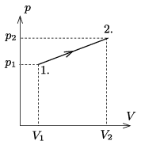

**Megoldás.**
 Jelöljük a kezdőállapotot 1-es, a végállapotot 2-es indexszel. A gáz kezdeti térfogata
 $V_1=V_0=4~\rm dm^3,$
 a folyamat végén pedig
 $V_2=V_0+Ah=7{,}5~\rm dm^3.$
 Amikor a melegítés hatására a dugattyú $x$ magassággal emelkedik, a gáz térfogata $V=V_0+Ax$, a nyomása pedig (a dugattyúra ható erők egyensúlya miatt) $p=p_0+\frac{mg+Dx}{A}
$ lesz. Ebből a két összefüggésből $x$ kiküszöbölése után kapjuk, hogy
 $p(V)=p_0+\frac{mg}{A}+\frac{V-V_0}{A^2}.$
 A nyomás a térfogat lineáris függvénye, tehát a folyamat a $p_V$ diagramon egy egyenessel írható le. (Az ábra nem méretarányos!)

 A kezdeti állapotban a nyomás
 $p_1=p_0+\frac{mg}{A}=100{,}7~\rm kPa,$
 a végállapotban pedig
 $p_2=p_0+\frac{mg+Dh}{A}=101{,}0~\rm kPa.$
 A folyamat során közölt hő a belső energia megváltozásának és a gáz által végzett munkának az összege. Az energiaváltozás:
 $E_2-E_1=\frac{3}{2}p_2V_2-\frac{3}{2}p_1V_1= 0{,}53~\rm kJ,$
 a gáz munkavégzése pedig
 $W'=\frac{p_1+p_2}{2}(V_2-V_1)=0{,}35~\rm kJ,$
 végül a közölt hő:
 $Q=\Delta E+W'=0{,}88~\rm kJ.$

 Megjegyzés. A gáz munkavégzése (a nyomások és a térfogatok behelyettesítése után) így is felírható:
 $W'=mgh+\frac{1}{2}Dh^2+p_0Ah.$
 Ebben a kifejezésben az egyes tagoknak szemléletes jelentése van. Az első a dugattyú gravitációs helyzeti energiájának növekedését adja meg. A második tag a rugóban tárolt rugalmas energiával egyenlő. Végül a harmadik tag azt a munkát adja meg, amennyi a $p_0$ nyomású légkör $Ah$ térfogatú részének ,,megemeléséhez'', a légkör helyzeti energiájának növeléséhez szükséges.

