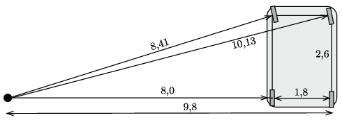

**Megoldás.**
 Az autó hátsó kerekei nem kormányozhatók. A kormányszerkezet csak az első kerekeket fordítja el, méghozzá különböző mértékben, hiszen csak így teljesíthető, hogy a kerekek nyomvonalára merőleges egyenesek ugyanabban a pontban (a körpálya középpontjában) találkozzanak.
 A megadott számokból (a Pitagorasz-tételt felhasználva) kiszámíthatjuk a keréknyomok pályasugarát (lásd az ábrát ), és ezekből a körpályák átmérőjét. Ezek rendre (növekvő sorrendben): 16,0 m, 16,8 m, 19,6 m és 20,3 m.

