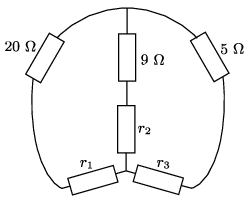
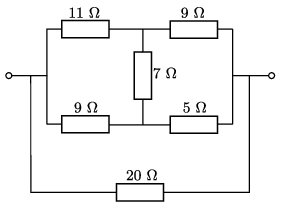

**I. megoldás.**
 Az áramkör alsó három, deltakapcsolású (más néven: háromszög kapcsolású) ellenállását az 1. ábrán látható csillagkapcsolással helyettesíthetjük. A megfelelő helyettesítő értékek (lásd pl. a ,,Négyjegyű'' megfelelő képleteit) ohm egységekben:
 $r_1=\frac{11}{3} \approx 3{,}67; \quad r_2=\frac{77}{27} \approx 2{,}85; \quad r_3=\frac{7}{3} \approx 2{,}33. $

 1. ábra

 A sorosan kapcsolt ellenállások eredője $9+r_2=11{,}85,$ illetve $5+r_3=7{,}33$ ohm, majd ennek a két értéknek a párhuzamos eredője $\left(\frac{1}{11{,}85}+
\frac{1}{7{,}33}\right)^{-1}=4{,}53$ ohm. Ezzel sorosan kapcsolva $r_1$-t az eredőjük 8,20 ohm, majd ezzel párhuzamosan kötve a 20 ohmos ellenállást megkapjuk a keresett eredőt:
 $R_\text{eredő}=
 \left(\frac{1}{8{,}20}+
\frac{1}{20}\right)^{-1}=5{,}8~\Omega.$
 Ugyanezt az eredmény úgy is megkaphatjuk, hogy az ábra közepén látható csillagkapcsolást alakítjuk át háromszög kapcsolássá.

**II. megoldás.**
 A kapcsolás a 20 ohmos ellenállást és vele párhuzamosan egy hídkapcsolást tartalmaz ( 2. ábra ). A hídkapcsolás eredőjét a hivatkozott cikk képleteit alkalmazva kiszámíthatjuk, majd ezzel párhuzamosan kapcsoljuk a $20~\Omega$-os ellenállást.

 2. ábra

 A végeredmény:
 $R_\text{eredő}=\frac{42\,460}{7303}~\Omega\approx
 5{,}8~\Omega.$

 Megjegyzés. Az eredő ellenállás értékének valódi tört alakban történő megadása azt a téves képet sugallja, hogy az a tört az eredmény ,,pontos'' értéke, míg a tizedes törttel megadott alak csak közelítés. Ez csak akkor lenne igaz, ha az egész számokkal megadott ellenállásnagyságok ($20~\Omega$, $11~\Omega$, $5~\Omega$ stb.) ,,végtelen pontos'' adatok lennének; de biztosan nem azok! Indokoltabb tehát az eredmény tizedes tört alakban történő megadása, annyi kiírt számjeggyel, amennyit a bemenő adatok megadott számjegyei alapján jogosnak vélhetünk.

