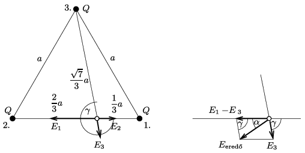

**Megoldás.**
 Használjuk az ábra jelöléseit!

 A kérdéses pont és a háromszög csúcspontjainak távolsága:
 $d_1=\frac13a; \qquad d_2=\frac23a;\qquad d_3=\frac{\sqrt{7}}3a.$
 ($d_3$-t pl. a koszinusztétel segítségével kaphatjuk meg.)
 Az egyes töltések által létrehozott elektromos térerősség nagysága $E_i=k\frac{Q}{d_i^2}$, vagyis
 $E_1= 13{,}48\cdot10^4~ \frac{\rm V}{\rm m}, \qquad E_2= 3{,}37\cdot10^4~ \frac{\rm V}{\rm m}, \qquad E_3= 1{,}93\cdot10^4~ \frac{\rm V}{\rm m}. $
 Az ábrán jelölt $\gamma$ szög ugyancsak a koszinusztétel segítségével:
 $\cos\gamma=\frac{1}{2\sqrt{7}}\approx 0{,}188 \qquad \Rightarrow \qquad \gamma\approx 79{,}1^\circ.$
 Az eredő térerősség (ismét a koszinusztétel felhasználásával):
 $E_\text{eredő}=\sqrt{(E_1-E_2)^2+E_3^2-2(E_1-E_2)E_3\cos\gamma}\approx 1{,}0\cdot10^4~\frac{\rm V}{\rm m}.$
 Az eredő térerősség-vektor irányát pl. a háromszög oldalharmadoló pontját tartalmazó élével bezárt $\alpha$ szöggel adhatjuk meg, felhasználva a szinusztételt:
 $\frac{\sin\alpha}{\sin\gamma}=\frac{E_3}{E_1-E_2} \qquad \Rightarrow \qquad \alpha\approx 10{,}8^\circ.$

