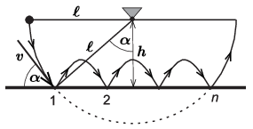

**Megoldás.**
 Jelöljük a fonálnak a függőlegessel bezárt szögét az első pattanás pillanatában $\alpha$-val. Az ábráról leolvasható, hogy
 $\cos\alpha=\frac{h}{\ell}.$

 A golyó sebességének nagysága az első ütközéskor (az energiamegmaradás törvénye szerint)
 $v=\sqrt{2gh},$
 és ennek a sebességnek vízszintes komponense
 $v_x=v\cos\alpha,$
 a függőleges komponense pedig
 $v_y=v\sin\alpha.$
 Két ütközés között
 $t=\frac{2v_y}{g}=\frac{2v\sin\alpha}{g}$
 idő telik el, ezalatt vízszintes irányban a golyó elmozdulása
 $s=v_x t=\frac{2v\sin\alpha}{g}\cdot v\cos\alpha=4h\,\sin\alpha\,\cos\alpha= \frac{4h^2}{\ell}\sin\alpha.$
 Ha a fonál újboli megfeszüléséig $n$ ütközés történik, akkor
 $(n-1)s=2\ell\sin\alpha,$
 vagyis
 $\frac{h}{\ell}=\frac1{\sqrt{2(n-1)}}.$

