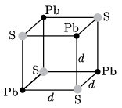
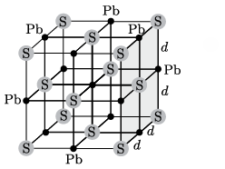

**Megoldás.**
 A galenit (PbS, azaz ólomszulfid), sűrűsége (interneten megtalálható adat) $\varrho=7{,}58~ \frac{\rm g}{\rm cm^3}$. A galenit kristályrácsa az 1. ábrán látható $d$ oldalélű kockákból áll.

 1. ábra

 Megjegyzés . A kristályrács ún. elemi cellája nyolc ilyen kis kockát tartalmazó, $2d$ oldalélű kocka, amelynek csúcsaiban és a lapjainak középpontjában ugyanolyan atom helyezkedik el ( 2. ábra ).)

 2. ábra
 Számítsuk ki, mekkora tömeg tartozik az 1. ábrán látható kis kockához. A négy ólomion mindegyike nyolc kockához tartozik, tehát a tömeg kiszámításánál csak az atomtömegük $\tfrac18$-át vehetjük figyelembe. Ugyanez érvényes a kénionokra is. Az ólom és a kén moláris tömege
 $m_{\rm Pb}=207{,}19~\frac{\rm g}{\rm mol},\qquad \text{illetve} \qquad m_{\rm S}=32{,}06~\frac{\rm g}{\rm mol},$
 a kis kockához tartozó tényleges tömeg:
 $m=\frac12\left(207{,}19+32{,}06\right)~\frac{\rm g}{\rm mol}\cdot
\frac{1}{6{,}022\cdot10^{23}~{\rm mol^{-1}}}=1{,}99\cdot10^{-22}~\rm g.$
 Mivel
 $\frac{m}{d^3}=\varrho,$
 a kis kocka oldalhossza kiszámítható:
 $d=\sqrt[3]{\frac{m}{\varrho}}=2{,}97\cdot 10^{-8}~\rm cm.$
 Ezek szerint a galenit rácsálladdója: $2d=5{,}94\cdot 10^{-8}~\rm cm,$ két szomszédos ólomion távolsága pedig
 $\sqrt{2}\,d=4{,}2\cdot 10^{-8}~\rm cm.$

