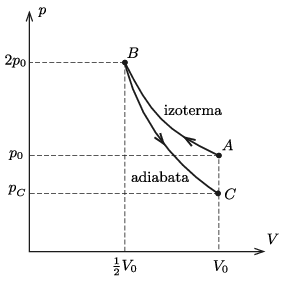

**Megoldás.**
 A folyamat a $p-V$ diagramon az ábrán látható módon szemléltethető.

 A megoldás során felhasználjuk a hőtan I. főtételét:
 $Q+W=\Delta E,$
 ahol $Q$ a gáz által felvett hő, $W$ a gázon végzett munka, $\Delta E$ pedig a belső energia megváltozása, valamint a
 $pV=nRT \qquad \text{és}\qquad E=\frac{f}{2}nRT=\frac{f}{2}pV$
 állapotegyenleteket.
 Esetünkben (normál állapotú levegőre) $n=1$ és $f=5$, a fajhőhányados $\kappa=\frac{f+2}{f}=1{,}4$, továbbá
 $p_0V_0=nRT_0=1~\text{mol}\cdot 8{,}31~\frac{\rm J}{\rm
mol\,K}\cdot 273{,}1 ~{\rm K}=2{,}27~\rm kJ.$
 Az $A\rightarrow B$ folyamat izotermikus, így $\Delta E=0$, továbbá ebben a folyamatban a gázon végzett munka (lásd pl. a Négyjegyű függvénytáblázatok 140. oldalát)
 $W_{A\rightarrow B}=\ln 2\, p_0V_0=1{,}57~\rm kJ.$
 A gáz által felvett hő:
 $Q_{A\rightarrow B}=-W_{A\rightarrow B}=-1{,}57~\rm kJ,$
 vagyis a gáz 1,57 kJ hőt ad le.
 A $B\rightarrow C$ folyamat adiabatikus, tehát $Q_{B\rightarrow
C}$. Az adiabatikus állapotegyenlet szerint
 $pV^\kappa=\text{állandó}=2p_0\left(\frac{V_0}2\right)^\kappa,$
 tehát
 $p_C=p_02^{ -0{,}4}=0{,}758~p_0.$
 A belső energia megváltozása ebben a részfolyamatban:
 $\Delta E_{B\rightarrow C}=E_C-E_B=\frac{5}{2}\left(p_CV_0-
p_0V_0)\right)=\frac{5}{2}p_0V_0\left(2^{-0{,}4}-1\right)=-0{,}605\,p_0V_0=-1{,}37~\rm
kJ,$
 és ugyanennyi a gázon végzett munka:
 $W_{B\rightarrow
C}=-1{,}37~\rm kJ.$
 $a)$ A gázon végzett összes munka:
 $W_{A\rightarrow B\rightarrow C}=W_{A\rightarrow B}+W_{B\rightarrow
C}=0{,}20~\rm kJ.$
 $b)$ A gáz által leadott összes hő:
 $Q^{(\rm leadott)}=-Q_{A\rightarrow B}=1{,}57~\rm kJ.$
 $c)$ A belső energia változása a folyamatban:
 $\Delta E_{A\rightarrow B\rightarrow C}=E_C-E_A=\frac{5}{2}\left(p_CV_0-
p_0V_0\right)=\frac{5}{2}p_0V_0\left(2^{-0{,}4}-1
\right)=-1{,}37~\rm kJ.$
 $d)$ A végállapot hőmérséklete a
 $p_CV_0=nRT_C$
 állapotegyenletből számítható ki:
 $T_C=\frac{0{,}758~p_0 V_0}{nR}=0{,}758\,T_0=0{,}758\cdot 273~{\rm K}=207~{\rm
K}=-66~^\circ\rm C.$

