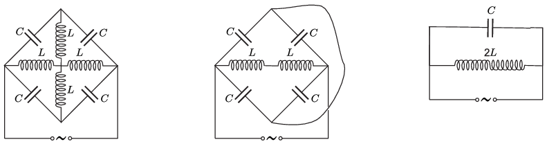

**Megoldás.**
 A kapcsolás ,,függőleges'' szimmetriatengelyén fekvő három pont minden időpillanatban ekvipotenciális, hiszen a generátorhoz kapcsolódó pontoktól ,,egyforma távolságra'' helyezkednek el. (Ha mondjuk a bal oldali csomópontot földeltnek tekintjük, és a jobb oldali csomópont feszültsége $U(t)$, akkor a három közbenső pont mindegyikén $\tfrac12 U(t)$ feszültség lesz.) Az ekvipotenciális pontok közötti tekercsek eltávolíthatók a kapcsolásból (hiszen rajtuk úgysem folyik áram), a felső és alsó csomópont pedig összerköthető (hiszen közöttük nincs feszültség, emiatt úgysem fog áram folyni.)

 Az átalakított kapcsolásban a párhuzamosan kapcsolt kondenzátorok eredője $2C$, a sorosan kapcsoltaké pedig $\tfrac12\cdot 2C=C$. A két sorosan kapcsolt tekercs eredő önindukciós együtthatója $2L$. (Ez csak akkor igaz, ha a tekercsek nincsenek nagyon közel egymáshoz, és emiatt a kölcsönös indukció elhanyagolható.) A kapcsolás akkor képvisel ,,végtelen nagy'' váltóáramú ellenállást, amikor a körfrekvencia (a Thomson-képlet szerint)
 $\omega=2\pi f=\sqrt{\frac{1}{2L\cdot C}},$
 vagyis a rezonanciafrekvencia
 $f_\text{rez.}=\frac{1}{\pi}\sqrt{\frac{1}{8L\, C}}.$

