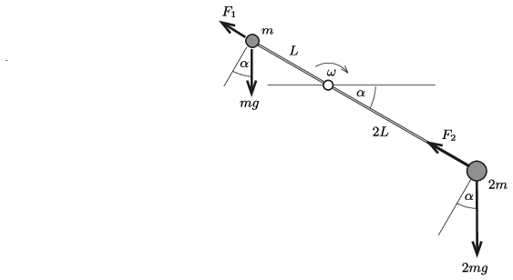
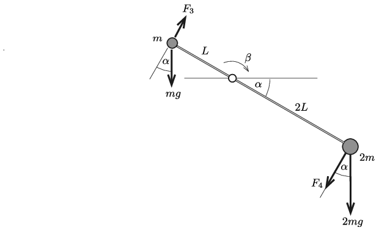

**Megoldás.**
 $a)$ A két testből és az elhanyagolható tömegű rúdból álló rendszernek a tengelyre vonatkoztatott tehetetlenségi nyomatéka
 $\Theta=mL^2+(2m)(2L)^2=9mL^2.$
 A rúd $\alpha$ szögű elfordulásakor a szögsebesség (az energiamegmaradás tétele szerint) így számolható:
 $\frac{1}{2}\Theta\omega^2=(2mg)(2L)\sin\alpha-mgL\sin\alpha,$
 vagyis
 $\omega=\sqrt{\frac{2}{3}\frac{g}{L}\sin\alpha}.$
 Jelöljük a $m$ tömegű testre a rúd által kifejtett erő rúd irányú komponensét $F_1$-gyel, a másik testnél az ennek megfelelő erőt $F_2$-vel ( 1. ábra ).

 1. ábra

 A mozgásegyenletek:
 $mg\sin\alpha-F_1=mL\omega^2,$
 ahonnan
 $F_1=\frac{1}{3}mg\sin\alpha,$
 illetve
 $F_2-2mg\sin\alpha=2m(2L)\omega^2,$
 vagyis
 $F_2=\frac{14}{3}mg\sin\alpha.$
 A tengelyre kifejtett rúdirányú erő ( a $m$ tömegű test felé)
 $N_1=F_1+F_2=5mg\sin\alpha.$
 $b)$ A testek nemcsak a rúd irányába, hanem arra merőlegesen is gyorsulnak. Ezt a tangenciális gyorsulást a nehézségi erőnek a rúdra merőleges komponense és a rúd által a rúdra merőleges irányban kifejtett $F_3$ és $F_4$ erő hozza létre ( 2. ábra ).

 2. ábra

 A mozgásegyenletek:
 $(1)$ $F_3-mg\cos\alpha=mL\beta$
 és
 $(2)$ $2mg\cos\alpha+F_4=2m(2L)\beta,$
 ahol az egész merev test szöggyorsulása a külső erők eredő forgatónyomatékából számítható ki:
 $\beta=\frac{2mg(2L)\cos\alpha-mgL\cos\alpha}{\Theta}=\frac{1}{3}\frac{g}{L}\cos\alpha.$
 Ezt a kifejezést visszahelyettesítva (1)-be és (2)-be, kapjuk, hogy
 $F_3=\frac{4}{3}mg\cos\alpha, \qquad \text{illetve}\qquad
F_4=-\frac{2}{3}mg\cos\alpha.$
 A tengelyre ható erőnek a rúdra merőleges összetevője:
 $N_2=F_3-F_4=2mg\cos\alpha.$
 A tengelyre ható teljes (eredő) erő
 $\vert\boldsymbol
N\vert=\sqrt{N_1^2+N_2^2}=mg\sqrt{25\sin^2\alpha+4\cos^2\alpha}=mg\sqrt{21\sin^2\alpha+4},$
 ami akkor egyezik meg $4mg$-vel, amikor
 $\sin^2\alpha=\frac{12}{21},\qquad
\text{azaz}\qquad\alpha=\arcsin\sqrt{\frac{12}{21}}=49{,}1^\circ.$

