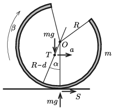
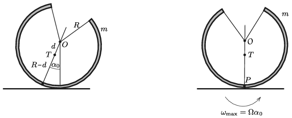

**I. megoldás.**
 Táblázati adatok szerint a hiányos hengerpalást tömegközéppontja $d=R\frac{\sin\delta}\delta$ távolságban van a henger tengelyétól, ahol $\delta=\pi-\frac{\varphi}{2}$. (Lásd pl. a Négyjegyű függvénytáblázatokban a Homogén tömegeloszlású vonalas alakzatok tömegközéppontja c. részt.) Esetünkben $\delta=5\pi/6$, tehát $d=0{,}191\,R=3{,}82~$cm.
 A hiányos hengerpalástnak az $O$ tengelyére vonatkoztatott tehetetlenségi nyomatéka $\Theta_O=mR^2,$ hiszen minden darabkája $R$ távol van az $O$ tengelytől. Eszerint a $T$ tömegközépponton átmenő tengelyre vonatkozó tehetetlenségi nyomaték (a Steiner-tétel szerint)
 $\Theta_T=\Theta_O-md^2=m(R^2-d^2).$
 Írjuk fel az $a\ll 1$ szöggel kitérített test mozgásegyenleteit és a csúszásmentes gördülés kényszerfeltételét.
 $\Theta_T\beta=-mgd\sin\alpha-S(R-d\cos\alpha),$
 $S=ma,$
 $(R-d)\beta=a.$
 Itt $S$ a korongra ható (tapadó) súrlódási erő, $a$ a tömegközéppont vízszintes irányú gyorsulása, $\beta$ pedig a szöggyorsulás. A függőleges irányú gyorsulás nagyon (másodrendűen) kicsi, emiatt az asztal által kifejtett nyomóerő $mg$-nek vehető ( 1. ábra ).

 1. ábra
 $S$ és $a$ kiküszöbölése után (a $\sin\alpha\approx \alpha$ valamint a $\cos\alpha\approx 1$ közelítést alkalmazva) kapjuk, hogy
 $\left(\Theta_T+m(R-d)^2\right)\beta=-mgd\cdot\alpha,$
 vagyis
 $\beta=-K\cdot \alpha,$
 ahol $K$ egy állandó. Ez egy olyan harmonikus rezgőmozgás egyenlete, amelyben a $K$ állandó $(2\pi/T)^2$-nel egyezik meg. Innen a rezgésidő:
 $T=2\pi \sqrt{\frac{(R-d)^2+R^2-d^2}{gd}}=2\pi \sqrt{\frac{2R(R-d)}{gd}}=2{,}61~\rm s.$

**II. megoldás.**
 Tekintsük a kicsiny $\alpha_0$ szöggel kitérített és kezdősebesség nélkül elindított hiányos hengerpalástot. A kicsiny kezdeti kitérés miatt a test szögelfordulása időben így változik:
 $\alpha(t)=\alpha_0\cos\Omega t,$
 ahol $\Omega=\frac{2\pi}{T}$ ($T$ a keresett periódusidő). Ez az időfüggés minden olyan mozgásra igaz, ahol egy stabil egyensúlyi helyzetből mozdítottuk ki a testet, és a rá ható erők a kitérésnek ,,sima'' (differenciálható) függvényei.
 A rezgőmozgás összefüggései szerint a hengerpalást legnagyobb szögsebessége (amikor áthalad az egyensúlyi helyzetén):
 $\omega_\text{max}=\alpha_0\,\Omega.$
 (Vigyázat: Ne tévesszük össze a rezgőmozgás $\Omega$ körfrekvenciáját a test $\omega$ szögsebességével!)
 Írjuk fel a test összes mechanikai energiáját a legnagyobb kitérésű és a legnagyobb szögsebességű állapotára, és alkalmazzuk az energiamegmaradás törvényét ( 2. ábra ):
 $mgd(1-\cos\alpha_0)=mgd\cdot 2\sin^2(\alpha_0/2)\approx mgd\frac{\alpha_0^2}{2}= \frac12\Theta_P \omega_\text{max}^2=
\frac12\Theta_P \left(\frac{2\pi}{T}\right)^2\,\alpha_0^2,$
 vagyis
 $mgd=\Theta_P \left(\frac{2\pi}{T}\right)^2.$
 Ebben a képletben
 $\Theta_P=\Theta_T+m(R-d)^2=\Theta_O+md^2+m(R-d)^2=2mR(R-d)$
 a testnek a talajjal érintkező $P$ pontjára vonatkozó tehetetlenségi nyomatéka a szimmetrikus helyzetben, amint azt a Steiner-tétel kétszeri alkalmazása után kaphatjuk.
 2. ábra
 Az energiamegmaradás egyenletéből követketik, hogy a periódusidő
 $T=2\pi\sqrt{\frac{2R(R-d)}{gd}}=2{,}61~\rm s.$

