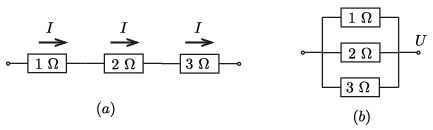
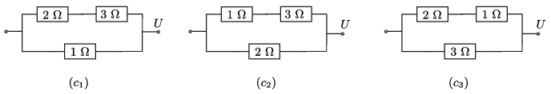
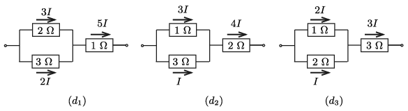

**Megoldás.**
 A három ellenállást nyolcféle módon kapcsolhatjuk össze.
 $(a)$ Mindhárom ellenállást sorosan kapcsoljuk ( 1.a) ábra ). Ekkor a rajtuk átfolyó áram erőssége egyforma, tehát a teljesítményük: $P_1=I^2\cdot 1~\Omega$, $P_2=I^2\cdot 2~\Omega$ és $P_3=I^2\cdot 3~\Omega$. (Az egyes elemekhez tartozó fizikai mennyiségeket az ellenállásuk ohmban mért értékével megegyező indexszel jelöljük.) Látható, hogy a legnagyobb teljesítmény $P_3$, és az akkor egyezik meg 1 wattal, ha $I^2=\frac13$. (Az SI mértékegységeket a továbbiakban nem írjuk ki.) Ekkor
 $(a)\text{~eset:} \hskip 2cm P_1=\frac13=0{,}33,\qquad P_2=\frac{2}{3}=0{,}67,\qquad P_3= 1{,}00,
\qquad \sum_{i=1}^3 P_i=2{,}0~\rm watt.$
 1. ábra
 $(b)$ A három ellenállást párhuzamosan kapcsoljuk, és valamekkora $U$ feszültséget kötünk rájuk ( 1.b) ábra ). Mivel a rájuk eső feszültség ugyanakkora, a teljesítmények: $P_1=U^2,$ $P_2=U^2/2$ és $P_3=U^2/3$. Látható, hogy a legnagyobb teljesítmény $P_1$, és az akkor egyezik meg 1 wattal, ha $U^2=1$. Ekkor
 $(b)\text{~eset:} \hskip 2cm P_1=1{,}00,\qquad P_2=\frac12=0{,}50,\qquad P_3=\frac13=0{,}33,
\qquad \sum_{i=1}^3 P_i=1{,}83~\rm watt.$
 $(c)$ Kapcsolhatunk két ellenállást sorosan, és a harmadikat velük párhuzamosan. Ezt háromféleképpen tehetjük meg ( 2.ábra ).
 2. ábra
 Tekintsük először a $(c_1)$ kapcsolást. Az 1 ohmos ellenálláson $U$, a másik kettőn $U/5$ erősségű áram folyik. Ennek megfelelően a teljesítmények:
 $P_1=U^2, \qquad P_2=2\left(\frac{U}{5}\right)^2=\frac{2}{25}U^2, \qquad P_3=\frac{3}{25}U^2.$
 Ezek közül $P_1$ a legnagyobb, és $U^2=1$ esetén éppen 1 watt. Ezek szerint
 $(c_1)\text{~eset:} \hskip 2cm P_1=1{,}00,\qquad P_2=\frac2{25}=0{,}08,\qquad P_3
=\frac3{25}=0{,}12,\qquad \sum_{i=1}^3 P_i=1{,}20~\rm watt.$
 Hasonló számítással kapjuk, hogy
 $(c_2)\text{~eset:} \hskip 2cm P_1 =1{,}00,\qquad P_2=\frac18=0{,}125,\qquad P_3=
\frac38=0{,}375,\qquad \sum_{i=1}^3 P_i=1{,}5~\rm watt,$
 és végül
 $(c_3)\text{~eset:} \hskip 2cm P_1 =1{,}00,\qquad P_2=\frac13=0{,}33,\qquad P_3=
\frac23=0{,}675,\qquad \sum_{i=1}^3 P_i=2{,}0~\rm watt,$
 $(d)$ Kapcsolhatunk két ellenállást párhuzamosan, és a harmadikat velük sorosan. Ezt is háromféleképpen tehetjük meg ( 3.ábra ).
 3. ábra
 Tekintsük a $(d_1)$ kapcsolást. A 2 ohmos és a 3 ohmos ellenállásokon folyó áramok aránya $3:2$, ekkor lesz ugyanis a rájuk eső feszültség ugyanakora. Legyen ez a kér áramerősség $3I$ és $2I$, a harmadik ellenálláson ekkor $5I$ erősségű áram folyik. Az egyes teljesítmények:
 $P_1=25\,I^2,\qquad P_2=3\cdot (2I)^2=12\,I^2, \qquad P_3=2\cdot (3I)^2=18\,I^2.$
 Ezek közül $P_1$ a legnagyobb, és $I^2=\frac{1}{25}$ esetén egyezik meg 1 wattal. A megfelelő teljesítmények ekkor:
 $(d_1)\text{~eset:} \hskip 2cm P_1=1{,}00,\qquad P_2=\frac{18}{25}=0{,}72,\qquad P_3
=\frac{12}{25}=0{,}48,\qquad \sum_{i=1}^3 P_i=2{,}2~\rm watt.$
 Hasonló számítással kapjuk, hogy
 $(d_2)\text{~eset:} \hskip 2cm P_1=\frac{9}{32}=0{,}28,\qquad P_2=1{,}00,\qquad P_3
=\frac{3}{32}=0{,}09,\qquad \sum_{i=1}^3 P_i=1{,}37~\rm watt,$
 és
 $(d_3)\text{~eset:} \hskip 2cm P_1=\frac4{27}=0{,}15\qquad
P_2=\frac{2}{27}=0{,}07,\qquad P_3 =1{,}00,\qquad \sum_{i=1}^3 P_i=1{,}22~\rm watt.$
 Összefoglalva megállapíthatjuk, hogy három ellenállás megengedett összteljesítménye 1,2 W és 2,2 W között változhat, és két kapcsolásnál is éppen 2 W az értéke.

