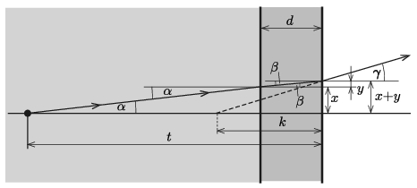

**Megoldás.**
 Tekintsük azt a fénysugarat, amely a falra merőleges irányhoz képest nagyon kicsi $\alpha$ szögben indul ki a halacska megfigyelt pontjából (lásd az ábrát , amely nem méretarányos). A fénysugár a víz-üveg határfelületen megtörik, és az optikai tengelyhez képest
 $\beta=\frac{n_\text{ü}}{n_\text{v}}\,\alpha$
 szögben halad tovább. (A törési törvényben a kicsiny szögek szinuszát a szögek radiánban mért értékével közelíthetjük.)

 Az üveg-levegő határfelülethez érve a $\beta$ beesési szögű fénysugár
 $\gamma=n_\text{ü}\,\beta=n_\text{v}\,\alpha$
 szögben halad tovább.
 Az ábráról leolvasható, hogy
 $x=(t-d)\,\alpha,\qquad y=d\,\beta \qquad \text{és}\qquad x+y=k\,\gamma,$
 vagyis
 $k=\frac{t-d}{n_\text{v}}+\frac{ d}{n_\text{ü}}=\frac34\,(20~{\rm cm}-12~{\rm mm})+\frac23\,(12~{\rm mm})=149~\rm mm.$
 Mivel $k$ nem függ a kicsiny $\alpha$ szögtől, valamennyi (kicsiny szögben kiinduló) fénysugár ugyanott metszi az optikai tengelyt, tehát itt, az akvárium külső falfelületétől $k=149~$mm távolságban jön létre a halacska kérdéses pontjának virtuális képe.

